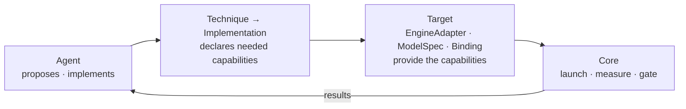

# optimizer

An agent-driven inference optimizer for diffusion models, modeled on NVIDIA's
Sol-Engine. You give it a model served by an engine (SGLang first); it
searches acceleration techniques and returns configurations that are faster
**and** pass a quality gate. Every speedup carries its baseline, its
measurement and its gate evidence.

Status: building Core. The architecture has been checked against SGLang's and
vLLM-Omni's real Qwen-Image and FLUX code paths by five experiments.
Components are built one at a time, in the order the ADRs set. Built so far:
the technique and implementation registries, capability resolution
([ADR 0017](docs/adr/0017-registries-and-capability-resolution.md)) and
feasibility ([ADR 0018](docs/adr/0018-feasibility-in-core.md)).

## Layout

    optimizer/core/             Core: specs, registries, capability resolution, feasibility
    optimizer/adapters/         engine-side knowledge Core asks for, e.g. SGLang's feasibility evaluator
    optimizer/catalog.py        the validated techniques, implementations and providers
    tests/                      interface tests: uv run --group dev python -m pytest
    docs/architecture.md        the current design (start here)
    docs/adr/                   decision records, one decision per file
    experiments/                throwaway spikes that test the design; each has a README

## Docs

Start with **Architecture**; the rest explains where it came from.

- [Architecture](docs/architecture.md) — the current design: what each concept means, where knowledge belongs, and how a technique gets onto a running engine
- [Decision records](docs/adr/README.md) — why each part is shaped the way it is, what was rejected, and what was superseded
- [Investigation: Qwen-Image and FLUX in SGLang](docs/architecture-investigation.md) — the evidence from SGLang's code, and the experiments that could still prove the design wrong
- [Experiment 001: step control](experiments/001-step-control/README.md) — one engine-level plugin on Qwen-Image-2.1 and FLUX.2-klein; why step control became three capabilities
- [Experiment 002: trunk control](experiments/002-trunk-control/README.md) — one TeaCache-style implementation on both models through per-model Bindings; what compile and graph replay do to it
- [Experiment 003: batched ownership](experiments/003-batched-ownership/README.md) — two requests in one SGLang DiT call; per-owner control holds, savings need agreement
- [Experiment 004: batched ownership on vLLM-Omni](experiments/004-omni-batched-ownership/README.md) — Qwen-Image-2512 requests at different steps in one DiT call; per-owner control holds on a second engine
- [Experiment 005: native FP8](experiments/005-native-fp8/README.md) — SGLang's FP8 through the whole optimizer path on both models; no glue, 1.5× faster, and why configuration is not evidence
- [Sol-Engine](docs/sol-engine.md) — the NVIDIA system this project is modeled on, and which parts of it are not public
