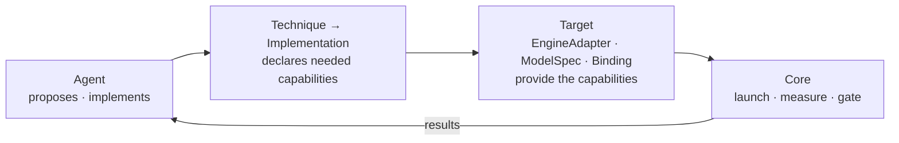

# optimizer

An agent-driven inference optimizer for diffusion models, modeled on NVIDIA's
Sol-Engine. You give it a model served by an engine (SGLang first); it
searches acceleration techniques and returns configurations that are faster
**and** pass a quality gate. Every speedup carries its baseline, its
measurement and its gate evidence.

Status: design phase. No code yet. The architecture has been checked against
SGLang's real Qwen-Image and FLUX code paths. Components are built one at a
time, in the order the ADRs set.

## Layout

    docs/architecture.md        the current design (start here)
    docs/adr/                   decision records, one decision per file
    experiments/                throwaway spikes that test the design; each has a README

## Docs

Start with **Architecture**; the rest explains where it came from.

- [Architecture](docs/architecture.md) — the current design: what each concept means, where knowledge belongs, and how a technique gets onto a running engine
- [Decision records](docs/adr/README.md) — why each part is shaped the way it is, what was rejected, and what was superseded
- [Investigation: Qwen-Image and FLUX in SGLang](docs/architecture-investigation.md) — the evidence from SGLang's code, and the experiments that could still prove the design wrong
- [Experiment 001: step control](experiments/001-step-control/README.md) — one engine-level plugin on Qwen-Image-2.1 and FLUX.2-klein; why step control became three capabilities
- [Sol-Engine](docs/sol-engine.md) — the NVIDIA system this project is modeled on, and which parts of it are not public
