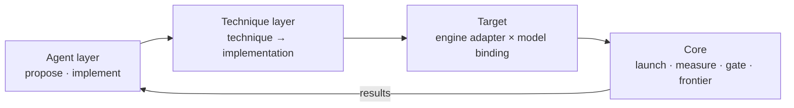

# optimizer

An agent-driven inference optimizer for diffusion models, modeled on NVIDIA's
Sol-Engine. You give it a model served by an engine (SGLang first); it
searches acceleration techniques and returns configurations that are faster
**and** pass a quality gate. Every speedup carries its baseline, its
measurement and its gate evidence.

Status: design phase. No code yet. The architecture has been checked against
SGLang's real Qwen-Image and FLUX code paths. Components are built one at a
time, in the order the ADRs set.

## Layout

    docs/                       design docs and decision records (start here)
    docs/adr/NNNN-*.md          one accepted decision per file

## Docs

- [Sol-Engine](docs/sol-engine.md) — what the system we're modeled on does, and which parts of it are not public
- [Architecture investigation](docs/architecture-investigation.md) — how Qwen-Image and FLUX actually run in SGLang, which seams are real, and the evidence behind ADRs 0005-0007
- [ADR 0001: Three layers](docs/adr/0001-three-layer-architecture.md) — why Core / Technique / Agent, and what each owns
- [ADR 0002: Scope](docs/adr/0002-scope-single-gpu-diffusion.md) — why one-GPU image diffusion first, and what is kept open
- [ADR 0003: SGLang first](docs/adr/0003-sglang-first-engine.md) — why SGLang, and the rule that keeps vLLM-Omni/ComfyUI addable
- [ADR 0004: Incremental build](docs/adr/0004-incremental-build-interface-tests.md) — how we build (one agreed piece at a time) and what gets tested
- [ADR 0005: Target binding](docs/adr/0005-target-binding-architecture.md) — Technique → Implementation → (engine × model) Target, and why model/engine aren't independent
- [ADR 0006: Lifecycle phases](docs/adr/0006-lifecycle-phases.md) — when an implementation may install, relative to compile and graph capture
- [ADR 0007: V1 seams and first techniques](docs/adr/0007-v1-seams-and-first-techniques.md) — the five seams, the composition metadata, and the three validation techniques
