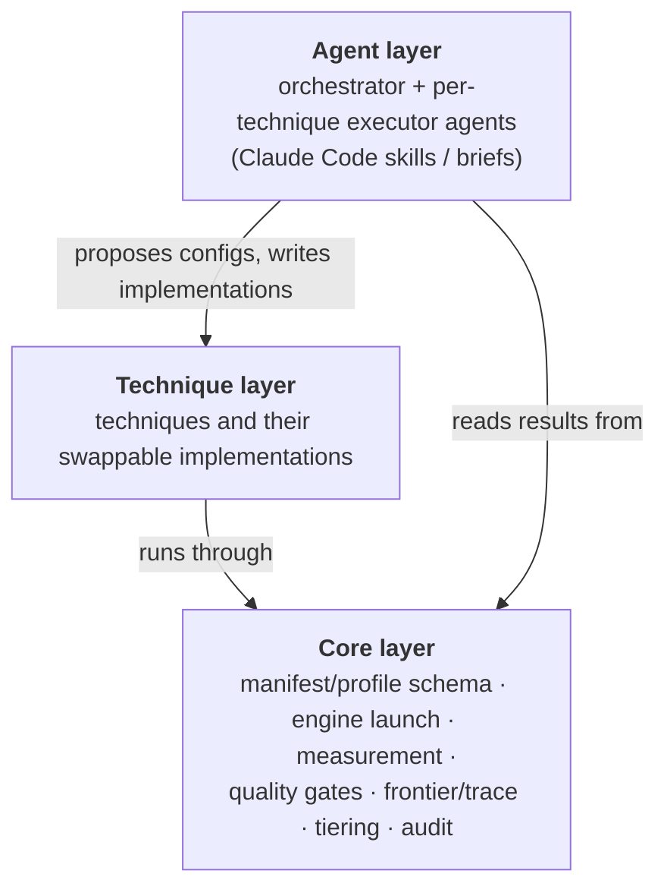

# ADR 0001: Three layers: Core, Technique, Agent

Status: accepted · 2026-10-01

## Context

We want an optimizer in the style of [Sol-Engine](../sol-engine.md). It should
take a diffusion serving setup and return faster configurations that pass a
quality gate. Sol-Engine publishes its *contract* (manifests, gates, technique
policies) but not its *loop* (evaluation, orchestration, adapters). Our
earlier diffusion-optimization work showed that measurement and gating are where
the expensive mistakes happen.

## Decision

Build three layers. Each layer depends only on the layer below it.

- **Core** is written by us, one piece at a time. That includes the profile
  schema and the evaluation. We do not copy Sol's harness wholesale.
- **Technique** is designed around an abstraction that makes implementations
  easy to add and swap. Its shape is decided by evidence; see
  [the seam investigation](../architecture-investigation.md).
- **Agent** comes last and is designed in discussion. Agents add and tune
  techniques; they do not bypass Core's gates.

## Consequences

- Speedup claims always go through Core's measurement and gates. An agent
  cannot report a number Core did not produce.
- Agents can be swapped or improved without touching how results are judged.
- More upfront work than wrapping Sol's scripts.

## Rejected

- **Fork Sol-Engine and fill in its stubs.** Its adapters are in an
  unpublished SGLang fork, and its manifests assume video and SLURM. Revisit if
  NVIDIA publishes the loop and runtime fork.
- **A purely programmatic search (grid/Bayesian) with no agent.** It can only
  tune knobs that already exist. Most of the gains in earlier work came
  from new fusions and shims, which needed code to be written.
