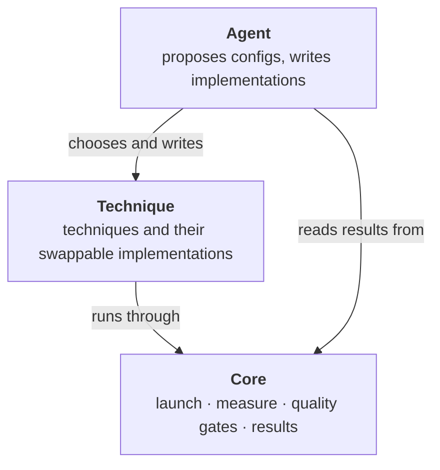

# ADR 0001: Three layers: Core, Technique, Agent

Status: accepted · 2026-10-01

## In short

The system is split into three layers. **Core** measures and judges. The
**Technique** layer holds optimizations. The **Agent** layer proposes and
writes optimizations. An agent can never report a speedup that Core did not
measure and gate.

## Context

We want an optimizer in the style of [Sol-Engine](../sol-engine.md): give it
a served model, get back faster configurations that still pass a quality
gate. Sol-Engine publishes its *contract* (config files, gates, technique
policies) but not its *loop* (evaluation, orchestration, model adapters). And
earlier diffusion-optimization work showed that measurement and gating are
where the expensive mistakes happen.

## Decision

- **Core** is written by us, one piece at a time, including the config
  schema and the evaluation. We do not copy Sol's harness wholesale.
- **Technique** is built around an abstraction that makes implementations
  easy to add and swap. Its shape comes from evidence; see the
  [architecture](../architecture.md).
- **Agent** comes last and is designed in discussion. Agents add and tune
  techniques, but they never bypass Core's gates.

## Consequences

- Every speedup claim goes through Core's measurement and gates.
- Agents can change or improve without changing how results are judged.
- More work up front than wrapping Sol's scripts.

## Alternatives rejected

- **Fork Sol-Engine and fill in its missing parts.** Its model adapters are
  in an unpublished SGLang fork, and its configs assume video and a SLURM
  cluster. *Revisit if* NVIDIA publishes the loop and the runtime fork.
- **A purely programmatic search (grid or Bayesian), no agent.** It can only
  tune switches that already exist. In earlier work most of the gains came
  from new fused kernels and integration code, which had to be written.
