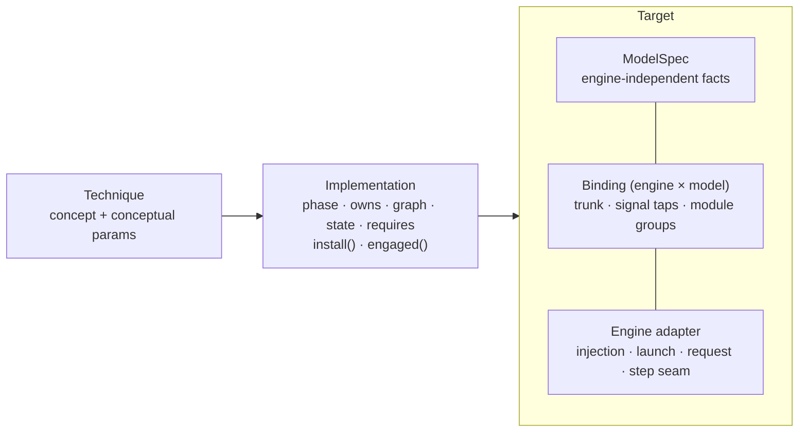

# ADR 0005: Technique → Implementation → Target (engine × model) binding

Status: superseded by [ADR 0008](0008-capability-layer.md) on 2026-10-01 · originally accepted 2026-10-01
Evidence: [architecture investigation](../architecture-investigation.md), parts 4, 5 and 8.

## Context

The starting hypothesis was a five-step chain: Technique → Implementation →
Standard Seam → Model Adapter → Engine Adapter, where model and engine were
independent axes. Reading SGLang's Qwen-Image and FLUX code showed three
problems with it:

1. SGLang *re-implements* each model. Where block 0 lives, and what its
   signature is, depends on the engine as well as the model.
2. A per-block seam does not exist across models: the three trunks have three
   different shapes.
3. Most native optimizations are launch args or request params, not code.

## Decision

- **Technique**: a concept with a conceptual parameter schema. Two
  implementations are the same technique only if they share the decision
  signal, the decision rule and the reused payload. Otherwise they are
  different techniques; for example, cache-dit DBCache is not TeaCache.
- **Implementation**: either *native* (configuration applied through the
  engine adapter) or *ours* (code attached to seams through the binding).
  Every implementation declares `phase`, `owns`, `graph`, `state`,
  `requires`, and provides `engaged()`, its authenticity evidence.
- **Target** = engine adapter + ModelSpec + binding.
  - The *engine adapter* is engine-wide and does not depend on the model.
  - *ModelSpec* holds facts true in every engine: CFG style, timestep scale,
    token layout, sensitive layers.
  - The *binding* is the thin, engine × model-specific map of where things
    live.
- Native implementations are preferred **by default**, not by rule.
  Measurement decides.

## Consequences

- Adding vLLM-Omni or ComfyUI means adding one engine adapter plus one
  binding per model. ModelSpecs and our generic implementations are reused.
- Adding a model means adding one ModelSpec plus one binding per engine.
- The optimizer can choose techniques without knowing the engine. Choosing
  the implementation happens at bind time.

## Rejected

- **Independent model and engine adapters.** Hook locations are a property of
  the engine's reimplementation of the model. Revisit only if all engines run
  the same model code; they do not.
- **One binding per technique per (engine, model), with no shared seams.**
  Simple, but every technique would be re-implemented for every target.
- **Treating native features as "implementations" of our techniques by name
  alone.** This is how results end up mislabeled and incomparable.
