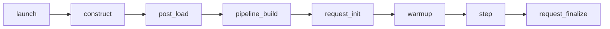

# ADR 0006: Lifecycle phases follow the engine's compile and capture points

Status: **superseded** by [ADR 0009](0009-lifecycle-constraints.md) on 2026-10-01 · originally accepted 2026-10-01

> **Read [ADR 0009](0009-lifecycle-constraints.md) instead.** This ADR made SGLang's eight lifecycle stages the shared vocabulary. Those stages are SGLang's own, and generic implementations should not depend on one engine's stages. The original text is kept below,
> unchanged, so the history of the design stays visible.

Original text

Evidence: [architecture investigation](../architecture-investigation.md), part 6.

## Context

The hypothesis used two phases, install and execute. SGLang has two points
that phase model cannot express:

- It compiles the DiT while **building the pipeline**, before any request
  (`DenoisingStage.__init__`, `denoising.py:380-383`).
- It captures breakable CUDA graphs during **warmup** (`runner.py:575-584`).

Whether an implementation works depends on which side of these points it
installs.

## Decision

An implementation installs in exactly one of these phases. They are ordered:

| Phase | What happens there | Example |
|---|---|---|
| `launch` | server args, env | attention backend, compile on/off, graph capture on/off |
| `construct` | modules built; `quant_method` chosen; QKV fused | FP8 / NVFP4, QKV fusion |
| `post_load` | weights processed; module replacement | VAE fusion, custom module swaps |
| `pipeline_build` | **compile happens here** | torch.compile |
| `request_init` | per-request attach/reset | TeaCache, step-skip state; cache-dit mount |
| `warmup` | dynamo trace, **graph capture** | (engine-owned) |
| `step` | runtime decisions | skip / reuse / refresh |
| `request_finalize` | state reset, evidence flush | engagement counters |

Each implementation also declares graph compatibility: `eager_only`,
`compile_ok` or `capture_ok`.

Rules:
1. Anything that changes the module tree must be in `construct` or
   `post_load`. Changing it later means reloading the model.
2. An `eager_only` implementation is **rejected** when graph capture is on.
   A captured graph replays without the Python control flow, and SGLang does
   not warn about it.
3. Execution decisions live in `step`. The install phase and the decision
   phase are separate fields.

## Consequences

- Two configs that differ only in `step`-phase parameters can share a loaded
  and compiled server. Configs that differ in `construct` or `post_load`
  cannot, and the launcher has to know that.

## Rejected

- **Two phases (install, execute).** Cannot express "must precede compile".
- **Generic `before`/`after` edges between techniques.** Every ordering
  constraint found in the code is a phase constraint.

