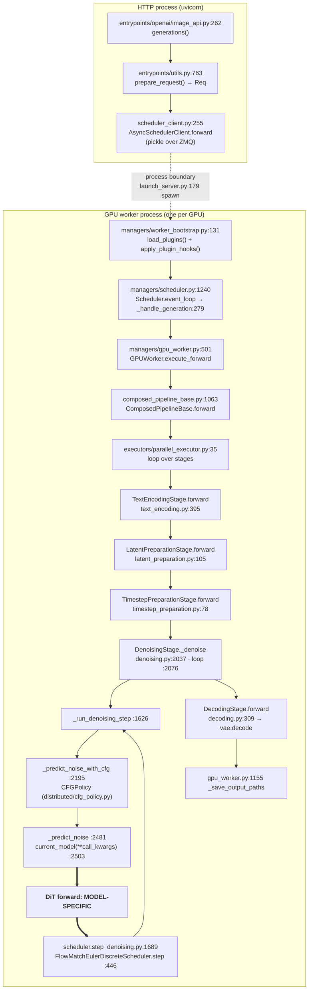
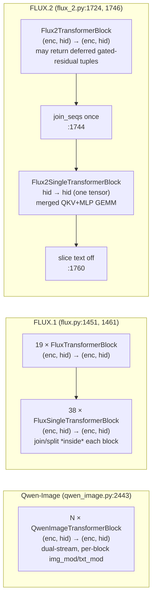
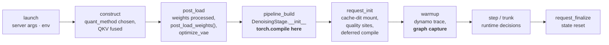
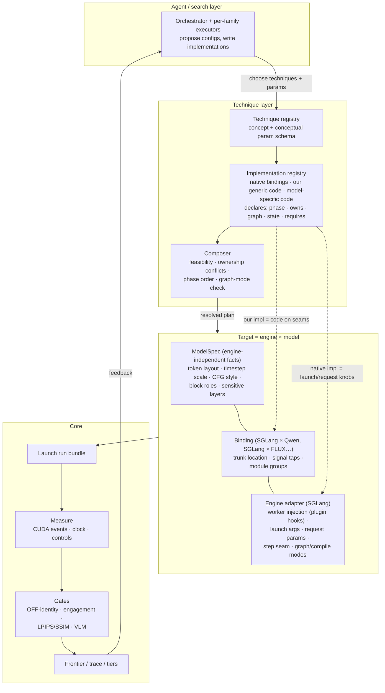

# How Qwen-Image and FLUX actually run in SGLang

Status: current · last substantive update 2026-10-01

This is the **evidence** behind the [architecture](architecture.md). It traces
real requests through SGLang's Qwen-Image and FLUX code to answer one
question: can optimization techniques plug into models and engines through a
small set of standard places, or not? It ends with the runtime experiments
that could still prove the design wrong.

## In short

1. **The engine does almost everything, and does it the same way for every
   model.** Request handling, the step-by-step denoising loop, guidance (CFG),
   the noise scheduler, attention, matrix multiplies and image decoding are
   shared SGLang code.
2. **The models differ in only two places:** small configuration callbacks
   (how the prompt and latents are prepared), and the inside of the
   transformer.
3. **"One block" means three different things.** Qwen-Image, FLUX.1 and
   FLUX.2 chain their transformer blocks in three incompatible ways. What is
   common is the **trunk**, the whole stack of blocks taken together.
4. **SGLang re-implements each model.** Where a part of the model lives
   depends on the engine *and* the model together.
5. **SGLang compiles the model before any request arrives, and records CUDA
   graphs during warmup.** When an optimization is installed therefore decides
   whether it works at all.
6. **SGLang already ships many optimizations as switches.** It also has an
   official plugin mechanism that runs our code inside its GPU worker
   processes.

## How to read this

- **Source:** upstream `sgl-project/sglang` at the commit pinned in
  [ADR 0003](adr/0003-sglang-first-engine.md). Paths are relative to
  `python/sglang/multimodal_gen/`, and `denoising.py` means
  `runtime/pipelines_core/stages/denoising.py`.
- **Abbreviations:** Q = Qwen-Image, F1 = FLUX.1, F2 = FLUX.2. "Graph capture"
  means SGLang's breakable CUDA graphs.
- **Evidence is folded.** Each section states its finding in prose; the
  `file:line` tables are inside the collapsible blocks.
- This is code reading only; nothing in it was run on a GPU.

---

## 1. One request, end to end

The model runs in a separate **GPU worker process**, not in the HTTP server
that receives the request. The request crosses into it over a socket, and
everything in the "GPU worker process" box happens there.



The same path serves both models. What changes is the configuration handed to
the shared stages, and the transformer itself:

| Step | Qwen-Image | FLUX.1-dev | FLUX.2 / klein |
|---|---|---|---|
| Stage recipe | `add_standard_t2i_stages` (`pipelines/qwen_image.py:49`) | `add_standard_t2i_stages` (`pipelines/flux.py:45`) | `add_standard_ti2i_stages` (`pipelines/flux_2.py:47`) |
| Text encoder | Qwen2.5-VL, drop first 34 tokens (`pipeline_configs/qwen_image.py:63`) | CLIP (pooled) + T5-512 | Mistral3 (dev) / Qwen3 (klein); stacked hidden layers (`pipeline_configs/flux.py:412,424`) |
| Latent pack | `_pack_latents` 2×2 → `(B, H/16·W/16, 64)` | same `_pack_latents` | `flux2_pack_latents` reshape + 4-D `latent_ids` |
| `mu` | `prepare_mu` (`pipelines/qwen_image.py:25`) | `prepare_mu` (`pipelines/flux.py:19`) | empirical, depends on step count (`pipelines/flux_2.py:16`) |
| Scheduler | **shared** `FlowMatchEulerDiscreteScheduler`, cloned per request | shared | shared |
| Guidance | **true CFG**, 2 sequential forward passes (`denoising.py:2297`), then norm-rescale (`qwen_image.py:237`) | **distilled guidance embedding**; no CFG unless a negative prompt is given | klein: neither; klein-base: true CFG |
| Timestep into the DiT | divided by 1000 inside the DiT (`qwen_image.py:2348`) | raw | raw; guidance ×1000 inside the DiT (`flux_2.py:1665`) |
| DiT forward | `qwen_image.py:2287` | `flux.py:1335` | `flux_2.py:1630` |
| VAE | `AutoencoderKLQwenImage` (Wan-style), `optimize_vae` uses the Wan fast path | AutoencoderKL | `AutoencoderKLFlux2` (BN stats), `flux2_vae_cuda_opt.py` |

**Where they part and rejoin.** The *control flow* is identical until the
loop calls the transformer (`_predict_noise`, `denoising.py:2503`), and it
rejoins as soon as the noise prediction comes back. The *data* differs
earlier, but only through configuration callbacks: prompt post-processing,
latent packing, the schedule shift `mu`, and the conditioning inputs. The
engine calls these callbacks; it never branches on the model.

<details>
<summary>Evidence: who owns each stage (file:line)</summary>

| Stage | Location | Shared? | Owner |
|---|---|---|---|
| Request / IPC | `image_api.py:262`, `scheduler_client.py:255`, `scheduler.py:1240` | shared | engine |
| Build and load | `gpu_worker.py:358` → `build_pipeline` (`pipelines_core/__init__.py:35`) → `TransformerLoader.load_customized` (`loader/component_loaders/transformer_loader.py:246`) | shared, plus a per-model `post_load_weights` (`qwen_image.py:2245`, `flux_2.py:1474`) | engine + model |
| Prompt encoding | `TextEncodingStage.encode_text` (`text_encoding.py:573`) | shared stage, model callbacks | engine + config |
| Latent init | `latent_preparation.py:105` | shared stage, model pack | engine + config |
| Timesteps | `timestep_preparation.py:78`, sigmas from `configs/pipeline_configs/base.py:1225` | shared; `mu` is per model | engine |
| Denoising loop / CFG / scheduler step | `denoising.py:2037`, `:2195`, `:1689` | shared | engine |
| DiT forward and block loop | `qwen_image.py:2443`; `flux.py:1451,1461`; `flux_2.py:1724,1746` | **model-specific** | model (SGLang's reimplementation) |
| Attention | `USPAttention.forward` (`runtime/layers/attention/layer.py:899`), `get_attn_backend` (`selector.py:171`) | shared layer, model call sites | engine + model |
| GEMM | `LinearBase.quant_method.apply` (`runtime/layers/linear.py:219,311,513,1199`) | shared | engine |
| VAE decode | `DecodingStage.decode` (`decoding.py:205`) | shared stage, model VAE | engine + model |

</details>


## 2. The trunk is where the models really differ



The three block loops disagree on argument names, on how many values a block
returns, and on where the text and image streams are joined. FLUX.2 blocks can
even return a lazy tuple that has to be materialized
(`_materialize_gated_residual`, `flux_2.py:1735`). A wrapper written for one
model's blocks breaks on the next model.

What *is* shared is the boundary around the whole stack. Each model prepares
its inputs, runs a trunk that maps `(image tokens, text tokens) → image
tokens`, and then applies the output layers. SGLang's own Spectrum cache
already treats the whole trunk as the unit it skips (`flux.py:1446-1475`).

## 3. Which interception points are real

| Proposed point | Verdict | In one line |
|---|---|---|
| model load | keep, but split | Quantization and fused QKV are decided when modules are *constructed*, before weights load. |
| denoise step | **keep** | Shared engine code with all the step state in view; the method is designed to be overridden. |
| transformer call | merge into denoise step | The call is shared; its arguments are model-specific, so treat them as opaque. |
| transformer block | **not portable** | Three incompatible trunk shapes. See [section 2](#2-the-trunk-is-where-the-models-really-differ). |
| attention | select, don't wrap | 25 backends are chosen by a launch flag; per-request swaps are refused under compile or graph capture. |
| linear (matmul) | keep | Every SGLang linear layer has a swappable `quant_method`; which layers count is model-specific. |
| CFG | part of denoise step | Shared policy object; FLUX.1-dev and FLUX.2-klein don't use true CFG at all. |
| scheduler | part of request setup | Timesteps are fixed per request; the shift `mu` is model-specific. |
| latent / resolution | not a seam | Repacking is per model; SGLang already ships progressive resolution per model. |
| VAE | load-time only | A module to replace at load, not a runtime hook. |

Four points the original list missed:
- **launch:** server flags and environment, the only way to reach most
  built-in optimizations.
- **request:** per-request switches. Cache-dit, progressive resolution, the
  CFG gate and fused-kernel quality levels are toggled per request.
- **trunk:** see section 2.
- **worker injection:** SGLang loads plugins (entry-point group
  `sglang.multimodal_gen.plugins`) in **every** GPU worker before the
  runtime starts (`worker_bootstrap.py:131`). Plugins can hook any function
  before, after, around or instead of it. Patching the launching process
  instead does nothing.

<details>
<summary>Evidence: every proposed point, with locations and risks</summary>

| Seam | Qwen location | FLUX location | Common abstraction? | Phase | Verdict and risks |
|---|---|---|---|---|---|
| `model_load` | `TransformerLoader.load_customized` → `post_load_weights` (`qwen_image.py:2245`) | same loader, `flux_2.py:1474` | **yes** | load | **Keep, but split it in two:** quantization and QKV fusion are decided at *module construction* (`linear.py:219`, `qwen_image.py:766`, `flux_2.py:514`). Post-hoc replacement after load fights the engine's own post-load hooks, such as the FP8 norm+quant enabled in `post_load_weights`. |
| `denoise_step` | `_run_denoising_step` (`denoising.py:1626`) | same | **yes**, engine-owned | runtime/step | **Keep.** Visible state: `DenoisingContext` (`:258`: timesteps, latents, cond kwargs, cfg_policy, `extra`), `DenoisingStepState` (`:295`: step_index, t, current_model), and the `Req`. The docstring says the method is meant to be overridden. |
| `transformer_forward` | `_predict_noise` (`:2481`) | same | **yes, if treated as opaque** | runtime/step | **Merge into the step seam** as "the denoiser call". The kwargs are model-specific, so treat them as opaque. Enough for whole-output reuse; not enough for residual caching. |
| `transformer_block` | `qwen_image.py:2443` | `flux.py:1451,1461`; `flux_2.py:1724,1746` | **no** | runtime/block | **Reject as a standard seam.** Replace with the **trunk** seam plus an optional model-bound block description. cache-dit already does this, with per-model `BlockAdapter`s and forward patterns (`cache/cache_dit_integration.py:496`, custom adapters at `:405-420`). |
| `attention` | `USPAttention` (`layer.py:899`) | same | **yes**, engine layer | launch / static | **Do not wrap it; select it.** The backend is chosen by `--attention-backend` (`selector.py:171`); 25 backends exist (`platforms/interface.py:29-54`). Per-request override is refused under compile or breakable CUDA graphs (`denoising.py:704-756`). Sparse patterns also need model facts (text-prefix length, image grid). |
| `linear` | `LinearBase.quant_method` | same | **yes**, engine layer | construct + post_load | **Keep as an engine capability.** Model-specific parts: Qwen-Image-2.1 uses plain `nn.Linear` for `img_in`/`proj_out`/modulation, which `quant_method` skips; FLUX.2 single blocks merge QKV+MLP into one GEMM; dense-guard names are per model. |
| `CFG` | `CFGPolicy` (`distributed/cfg_policy.py:34`), swappable via `pipeline_config.cfg_policy` | same | yes, engine | runtime/step | **Fold into the step seam** as a *branch* dimension. FLUX.1-dev and klein have no true CFG by default, so CFG techniques are model-conditional, not universal. |
| `scheduler` | shared FlowMatchEuler, `scheduler_class_override` (`scheduler_loader.py:50`) | same | yes | request | **Keep as the "schedule" part of the request seam.** Timesteps and sigmas are fixed per request in `TimestepPreparationStage`. `mu` is model-specific. |
| `latent/resolution` | `progressive_resolution/qwen_image.py:53` | `progressive_resolution/flux.py`, `flux_2.py` | **no** | request | **Reject as a seam.** Pack/unpack/repack is model-specific, and SGLang already implements it per model behind `progressive_mode`. Treat it as a native-only technique. |
| `VAE` | `DecodingStage` + `optimize_vae` (`platforms/cuda.py:838`) | same | stage is common; module is not | load | **Keep only as a load-time module target**, not as a runtime seam. |


| Missing seam | Evidence | Why it is needed |
|---|---|---|
| **launch** (server args and env) | Attention backend, `--enable-torch-compile`, `--enable-breakable-cuda-graph`, `--quantization`, `SGLANG_CACHE_DIT_*` | Most native techniques can *only* be expressed here. |
| **request** (per-request sampling params and plan) | `enable_cache_dit`, `progressive_mode`, `cfg_gate_step`, `quality`, `enable_spectrum` (`configs/sample/sampling_params.py:317-345`) | A large share of SGLang's optimizations are toggled per request. |
| **trunk** | see [1.3](#2-the-trunk-is-where-the-models-really-differ) | This is the portable unit for whole-trunk caching (TeaCache residual variants, first-block cache, Spectrum). |
| **worker injection** (engine-internal, not a technique seam) | `worker_bootstrap.py:131`: `load_plugins()` and `apply_plugin_hooks()` run in **every** spawned worker; entry-point group `sglang.multimodal_gen.plugins`, allow-list `SGLANG_PLUGINS`; hooks are BEFORE/AFTER/AROUND/REPLACE on dotted targets (`runtime/platforms/plugins.py:88`) | Every hook we install has to cross a process boundary. Patching the launching process does nothing. |

</details>


## 4. What SGLang already ships

| Technique | In SGLang? | Wired for Q / F1 / F2 | What it needs from us | Watch out |
|---|---|---|---|---|
| TeaCache | yes | **no / no / no** | trunk + a per-model signal | breaks graph capture silently |
| Block cache (cache-dit DBCache) | yes, external package | yes / yes / yes | nothing (native) | must mount before compile; refused under graph capture |
| Step skip | Spectrum (F1 only), cache-dit step masks | no / yes / no | the denoise step only | in-transformer versions break graph capture |
| Fewer steps / new schedule | yes | yes / yes / yes | request setup | changes other caches' step schedules |
| CFG gate | yes | meaningful for Q only | denoise step | off when CFG runs in parallel |
| Block skipping | SD3 only | no / no / no | per-model block access | quality-sensitive |
| Progressive resolution | yes | yes / yes / yes | nothing (native only) | refuses sequence parallelism |
| FP8 / NVFP4 linear | yes | yes / yes / yes (NVFP4: F2 checkpoint) | nothing (native) | changes which fused QKV exists |
| Fused kernels | yes | yes / yes / yes | model code | some are refused under graph capture |
| Attention backend | 25 backends | all | launch flag | per-request swaps refused under compile |
| torch.compile | whole transformer | whole only (no regional for Q/F1/F2) | launch flag | happens at pipeline build |
| Graph capture | yes | yes / yes / **no** | launch flag | refuses cache-dit and quality kernels |

<details>
<summary>Evidence: the full technique matrix (install time, decision time, conflicts, file:line)</summary>

| Technique | Concept | Native in SGLang | Q / F1 / F2 wired? | Install | Decides at | Seams | Generic implementation realistic? | Compile / graph | Conflicts found in code |
|---|---|---|---|---|---|---|---|---|---|
| **TeaCache** | Skip the trunk when an accumulated, rescaled rel-L1 of the timestep-modulated input stays under a threshold | `cache/teacache.py`, `TeaCacheMixin` in `CachableDiT` | **no / no / no** (Wan, Hunyuan, LingBot only) | request init | per step | step + **trunk** + a model-specific "modulated input" signal | **partially.** The controller is generic; the signal tap and the rescale coefficients are per model. | `.item()` host sync breaks graphs (`teacache.py:196`) | excludes Spectrum (`sampling_params.py:720`); no guard against breakable CUDA graphs |
| **Block cache (DBCache / FBCache)** | Reuse the residual of block `n..N` when the first-`n`-block residual barely changes | cache-dit (`cache_dit_integration.py:496`) | yes / yes / yes | request init, **before compile** | per step, per block | per-block adapter (cache-dit owns it) | **prefer native.** cache-dit already ships per-model forward patterns. | compile deferred until mounted (`denoising.py:544,612`) | refused under breakable CUDA graphs (`:1025`); FSDP; DMD vs TaylorSeer |
| **DPCache** (schedule-searched cache) | — | **not in this commit** (open upstream PR sgl-project/sglang#40848) | — | — | — | — | — | — | — |
| **Step skip / fixed-step reuse** | Reuse or extrapolate the noise prediction on chosen steps | Spectrum (F1 only); cache-dit SCM step masks | no / yes / no; SCM: yes / yes / yes | request | per step | **step only** | **yes, fully.** The noise prediction is an opaque tensor. | needs eager control flow; breaks under breakable CUDA graphs. *CHANGED 2026-10-01: true only for in-DiT skipping (Spectrum, `flux.py:1446`). A step-seam implementation skips the DiT call, and graphs are replayed per call (`denoising.py:2500`, `breakable_cuda_graph/runner.py:300`), so it is expected to be capture-safe. Unverified.* | Spectrum vs TeaCache |
| **Timestep reduction** | Fewer steps or a different sigma schedule | `num_inference_steps`; `scheduler_class_override` | yes / yes / yes | request | request | request (schedule) | yes | changes shapes for nothing; changes graph count for nothing | invalidates per-step schedules of other caches |
| **CFG skip / gate** | Reuse `uncond = cond − cached delta` after step `k` | CFG gate (`denoising.py:1483-1530`) | Q only meaningful (FLUX.1-dev and klein have no true CFG) | request | per step | step (branch dimension) | yes | eager tensor math | disabled with CFG-parallel (`:1498`) |
| **Block skipping** | Drop blocks entirely | SD3 `skip_layers` only | no / no / no | — | per step | trunk + block description | needs model block description | — | quality-sensitive |
| **Progressive resolution** | Coarse-to-fine latent resolution | `progressive_resolution/*` | yes / yes / yes | pipeline build | request (multi-stage) | not a seam (model-specific repack) | **no, keep native** | shapes miss captured graphs | refuses sequence parallel (`progressive_resolution/denoising.py:464`) |
| **NVFP4 linear** | 4-bit weights and activations on chosen linears | `ModelOptFp4LinearMethod` (`modelopt_quant.py:694,798`); `Flux2NvfpPipeline` | Qwen FP4 path / – / yes | construct + post_load | static | linear (`quant_method`) | **prefer native.** It needs a prequantized checkpoint and a kernel. | before compile | forces a precision-preserving attention backend (`transformer_loader.py:507`) |
| **FP8 linear** | 8-bit GEMM | `Fp8Config` (`layers/quantization/fp8.py:77`), `ModelOptFp8Config` | yes / yes / yes | construct (online FP8 quantizes after load) | static | linear | prefer native | before compile | changes which QKV fusion exists (`qwen_image.py:766`, `flux_2.py:514`) |
| **QKV fusion** | One GEMM for Q/K/V | construction-time key remap (`qwen_image.py:303-330`) | quant-dependent / Nunchaku only / FP4/FP8 | construct | static (Qwen added-QKV is a per-request quality site) | linear + module structure | model-specific | before compile | quality sites refused under breakable CUDA graphs (`denoising.py:786`) |
| **Attention backend** | Different kernel, same math (or sparse) | 25 backends, `selector.py:171` | all | launch | static | launch | select, don't implement | per-request override refused under compile or graphs | sparse default, ring vs skip_softmax |
| **Custom fused kernels** | Fuse norm, modulate, RoPE, SiLU-mul | bit-exact gated (`kernels/ops/diffusion`); quality "sites" (`denoising.py:179-240`) | yes / yes / yes | always on, or per request (`quality`) | per call | inside the model (module code) | **model-specific code** (agent-written) | bypassed while compiling or capturing | quality sites vs breakable CUDA graphs |
| **VAE fusion** | Fused GroupNorm+SiLU, channels_last | `optimize_vae` (`platforms/cuda.py:838`), `flux2_vae_cuda_opt.py`, `wan_vae_cuda_opt.py` | yes / yes / yes | post_load | per decode (quality-gated) | load (VAE module) | per VAE class | VAE compile is separate (`decoding.py:170`) | spatial-parallel decode |
| **torch.compile** | Inductor over the DiT | `DenoisingStage._maybe_torch_compile` (`denoising.py:535`) | whole DiT only (no `_compile_conditions` for Q/F1/F2) | **pipeline build** (or deferred) | static | launch | native | — | skipped under breakable CUDA graphs; refuses per-request attention override |
| **Breakable CUDA graph** | Capture the DiT with eager breaks at attention | `breakable_cuda_graph/runner.py` | yes / yes / **no** (allowlist `server_args.py:234`) | lazy; captured at **warmup** | replay | launch | native | replaces compile | cache-dit, quality fusions, attention override; **TeaCache and Spectrum are unguarded and silently become no-ops** |

</details>


**Worked example: TeaCache.** TeaCache skips the trunk when the
timestep-modulated input has barely changed since the last computed step, and
reuses the cached trunk output instead.
- **Where it plugs in:** it needs three things. The denoise step tells it
  which step and which CFG branch it is on. The trunk lets it run or replay.
  A per-model *signal tap* gives it the modulated input of the first block.
- **Native coverage:** SGLang has a TeaCache, but none of our models calls
  it.
- **The per-model part:** the signal comes from `img_mod` in Qwen's first
  block (`qwen_image.py:1306`), and from the shared modulation computed once
  per forward in FLUX.2 (`flux_2.py:1669-1671`).
- **What can be shared:** the controller is generic. The signal tap and the
  rescale coefficients are per model.

## 5. Is "technique vs implementation" a useful split?

Yes, but cache-dit showed where to draw the line. What SGLang ships for these
models is cache-dit's block cache. It decides from a *block residual*, not
from the *modulated input*, and it reuses per-block outputs. So it is a
**different technique**, not another implementation of TeaCache.

> **Rule:** two implementations are the same technique only if they share the
> decision signal, the decision rule and the reused payload. They may differ
> only in mechanism: where they hook, which kernel, which language.

<details>
<summary>The questions this answered</summary>

| Question | Answer from the code |
|---|---|
| Can the optimizer pick "TeaCache" without engine details? | **Yes.** The search space is over techniques and conceptual params. *Feasibility* is a query against the target: is any implementation available for (sglang, qwen-image)? |
| Can implementation selection happen later? | **Yes**, at bind time, once the target is known. |
| One shared parameter schema? | **Yes for conceptual params; no for the rest.** Each implementation declares its own extras. |
| Conceptual vs implementation params | Conceptual: `threshold`, `warmup_steps`, `max_consecutive_reuse`, `tail_protect_steps`. Implementation-specific: rescale coefficients (per model), hook target, sync behaviour. |
| Should native have priority? | **By default, yes.** Native implementations already handle the engine's ordering, for example cache-dit deferring compile and mounting before it (`denoising.py:544`). But it is a default, not a rule; the measurement decides. |
| SGLang has cache-dit, not exactly our algorithm? | Register cache-dit as its **own technique** (block-residual cache) and implement TeaCache ourselves. Never label cache-dit "TeaCache"; a mislabeled result cannot be compared with anything. |

</details>


## 6. Are "model" and "engine" independent?

Not where hooks are concerned. "Where is Qwen's first block?" has a different
answer in SGLang, in diffusers and in ComfyUI, because each re-implements the
model.

| Concern | Model? | Engine? | Evidence |
|---|---|---|---|
| Find transformer blocks | yes | **yes** | Module paths and signatures are SGLang's reimplementation (`runtime/models/dits/*.py`), not diffusers' or ComfyUI's. |
| Intercept the denoise loop | no | yes | `DenoisingStage._run_denoising_step` is shared engine code. |
| Replace Linear | partly (which modules, guards) | yes (`LinearBase.quant_method` is SGLang's) | `linear.py:219`; Qwen-2.1's plain `nn.Linear`. |
| Request-local state | no | yes | `Req`, `forward_context` (`managers/forward_context.py:55`), `ctx.extra`. |
| Timestep semantics | yes | no | Qwen divides by 1000 in the DiT; FLUX.2 multiplies guidance by 1000 inside; the scheduler is shared. |
| Attention replacement | yes (token layout) | yes (backend registry) | `selector.py:171` plus `img_shapes`, `txt_seq_lens`. |

What *does* separate cleanly became the three responsibilities in the
[architecture](architecture.md#terms): EngineAdapter, ModelSpec and
Binding.

## 7. SGLang's lifecycle

These are **SGLang's** stages. Other engines will differ; see
[ADR 0009](adr/0009-lifecycle-constraints.md).



What this means for an optimization:
1. **Anything that changes the model's modules** has to be in place before
   the pipeline is built. Changing it later means reloading the model.
2. **Python decisions *inside* the transformer** are lost under graph capture:
   the recorded graph replays without them, and SGLang does not warn.
   TeaCache and Spectrum are in this group. Decisions in the denoising loop
   *around* the transformer are expected to be safe, because graphs are
   replayed once per transformer call (`denoising.py:2500`,
   `breakable_cuda_graph/runner.py:300`). That is unverified; experiment 1
   tests it.
3. **Optimizations attached per request** that change the forward pass must
   come before a deferred compile. cache-dit is the only native one, and
   SGLang orders it itself.

<details>
<summary>Evidence: the order SGLang actually runs these in</summary>

Evidence:
- **Order of load steps:** `transformer_loader.py:246` → `fsdp_load.py:485-486` → `transformer_loader.py:549`.
- **Compile:** happens in `DenoisingStage.__init__` (`denoising.py:380-383`), which runs during `create_pipeline_stages` (`composed_pipeline_base.py:172`).
- **Request-init order:** `_maybe_enable_cache_dit_and_torch_compile` (`denoising.py:584`) runs, in order:
  1. attention override
  2. quality sites
  3. cache-dit
  4. deferred compile
- **Graph capture:** happens only when `is_warmup` (`breakable_cuda_graph/runner.py:575-584`).

</details>


## 8. Conflicts found in the code

Every conflict below is real, and each is caught by one field of the
[implementation contract](architecture.md#implementation-contract).

| Conflict found in SGLang | Caught by |
|---|---|
| FP8 and NVFP4 both want the same linear layers; TeaCache, Spectrum and cache-dit all want the trunk; the CFG gate and parallel CFG both want the guidance branch | `owns` |
| cache-dit, quality kernels and per-request attention swaps are refused under graph capture; TeaCache and Spectrum silently do nothing under it | execution requirements (`runs_every_invocation`), interpreted by the adapter against the applied graph mode ([ADR 0013](adr/0013-feasibility-and-engagement.md)) |
| replacing modules after the pipeline is built runs uncompiled or needs a reload | `constraints` (`mutates_model`) |
| TeaCache and Spectrum keep state on the module and reset it at step 0 | `constraints` (`request_state`) |
| graph capture is not allowed for FLUX.2; progressive resolution refuses sequence parallelism; CFG techniques need true CFG, which FLUX.1-dev lacks | `requires` (resolution fails) |

**Worked combination:** NVFP4 + fused QKV + torch.compile + TeaCache + step skip.
- NVFP4 and fused QKV are coupled: on FLUX.2 the fused QKV exists *because*
  of the quantization config (`flux_2.py:514`).
- Both must be in place before compile.
- Step skip and TeaCache can coexist only if a skipped step never reaches the
  trunk, so the composer has to order them or reject the pair.
- TeaCache is rejected whenever graph capture is on.

---

## Open items

Runtime experiments, ordered so that the cheapest one that could *falsify* the
architecture runs first. Each one names the claim it can break.

- [x] **1. Step control is engine-wide.** Capture safety, originally part of
      this item, is split out as 1b. One plugin
      (`sglang.multimodal_gen.plugins`) wraps `_run_denoising_step` and skips
      the DiT on chosen steps. Run the *same* code on Qwen-Image and
      FLUX.2-klein, then on Qwen-Image with breakable CUDA graphs on.
      - Falsified if either model needs model-specific code to skip a step.
      - Falsified if graph replay misbehaves when calls are skipped.
      - **Done** ([experiment 001](../experiments/001-step-control/README.md)):
        the same plugin worked on both models with no model-specific code,
        but skipping a whole step desyncs the scheduler, so step control was
        split ([ADR 0011](adr/0011-split-step-control.md)).
- [x] **1b. Step capabilities are capture-safe.** Run `step_observe`,
      `step_prediction_override` and `step_schedule_mutate` on Qwen-Image-2.1
      with breakable CUDA graphs on. (FLUX.2 cannot be used: it is not on
      SGLang's graph-capture allowlist and falls back to eager.)
      - Falsified if graph replay misbehaves when a prediction is overridden.
      - **Done** ([experiment 001](../experiments/001-step-control/README.md)):
        steps replayed from graphs and every request was bitwise identical to
        eager. Graphs replay only at the warmup prompt's exact length, so
        replays have to be counted, not assumed.
- [x] **2. Trunk control resolves per Binding and survives compile.**
      Implement trunk control for both models with reuse disabled, and
      require OFF-identity (bit-exact against the unwrapped model) in eager
      and under torch.compile.
      - Falsified if the wrapper cannot be identical in eager mode.
      - Falsified if compile breaks it beyond an acceptable graph-break count.
      - **Done** ([experiment 002](../experiments/002-trunk-control/README.md)):
        identical in eager and under regional compile, with one generic
        implementation and two small Bindings. Whole-model compile triples the
        graph breaks and, on FLUX.2, an identity override changes the image;
        graph replay never runs the hooks. Recorded in
        [ADR 0012](adr/0012-trunk-capabilities.md).
- [ ] **2b. Trunk capabilities work when one model call serves several
      requests or CFG branches.** ComfyUI batches cond and uncond into one
      call and vLLM-Omni batches requests, so override and signal would act
      per batch slice. SGLang ran one request and one branch per call in
      experiment 002.
      - Falsified if a per-slice override cannot be expressed without the
        implementation knowing the batch layout.
      - Also answers whether `signal_observe` must return a structured view
        that says which slice belongs to which execution item
        ([ADR 0012](adr/0012-trunk-capabilities.md), Open), and whether
        engagement can be proven per item rather than per call
        ([ADR 0013](adr/0013-feasibility-and-engagement.md)).
      - SGLang has dynamic batching (`batching_mode=dynamic`,
        `batching_max_size > 1`), so it can be tried there first; whether it
        puts two Qwen-Image-2.1 or FLUX.2 requests into one DiT call is the
        first thing to check.
- [x] **3. Capabilities are not SGLang-shaped.** By code reading only, map
      the step capabilities, trunk control and `request_local_state` onto
      vLLM-Omni's and ComfyUI's Qwen-Image/FLUX paths.
      - Falsified if a capability cannot be expressed without SGLang concepts.
      - **Done** (experiment 002,
        [portability check](../experiments/002-trunk-control/README.md#portability-sanity-check-code-reading-only)):
        every capability has a plausible boundary in both engines, and
        vLLM-Omni's own TeaCache already uses per-model extractors that play the
        Binding's role. Two contract gaps remain: batched calls (item 2b) and
        ComfyUI having no request, only a sampling run.
- [ ] **4. A native implementation is configuration plus an engagement check.**
      Launch native FP8 on both models and count the live FP8 `quant_method`s.
      - Falsified if model-specific glue is needed, e.g. Qwen-Image-2.1's
        plain `nn.Linear`.
- [x] Check whether FLUX.2 klein's layer count and forward kwargs differ from
      FLUX.2-dev in the loaded checkpoint config. FLUX.2-klein-base-4B has 5
      double-stream and 20 single-stream blocks, and loads as SGLang's
      `Flux2Transformer2DModel`, the class FLUX.2's other checkpoints use; its
      forward kwargs were not compared with FLUX.2-dev's (experiment 002).
- [ ] Decide whether to support FLUX.1 at all. FLUX.2-klein is the target,
      and FLUX.1 differs: Spectrum is wired there, it uses a distilled guidance
      embedding, and its blocks join per block.

---

## Appendix: the first conclusions (superseded)

The conclusions first drawn from this evidence were recorded in ADRs
0005–0007. They have since been refined into the [architecture](architecture.md)
and ADRs 0008–0010. The original text is kept here unchanged.

<details>
<summary>Original Parts 8–10 (superseded 2026-10-01)</summary>

#### Part 8: revised architecture




Where native SGLang features fit: a native implementation is an
`Implementation` whose mechanism is **configuration**. It sets launch args,
env vars or request params through the engine adapter, and declares
`requires: engine=sglang, model∈{…}`. Our generic implementations are code
attached to seams through the binding. Both kinds go through the same
composer and the same Core gates. An engagement check, meaning "did it
actually run", is mandatory for both.

---

#### Part 9: minimal interfaces

Every field below is required by a named technique. A field with no
technique behind it was left out.

```python
class TechniqueSpec:                 # "what"
    name: str                        # "teacache", "step-skip", "fp8-linear"
    params: Schema                   # conceptual params only (TeaCache: threshold, warmup, max_reuse)

class ImplementationSpec:            # "how"
    technique: str
    name: str                        # "ours-generic", "sglang-native"
    phase: Phase                     # NVFP4/FP8 → construct; TeaCache → request_init; compile → pipeline_build
    owns: frozenset[str]             # NVFP4 vs FP8 ("linear.quant"); TeaCache vs block cache ("trunk.forward")
    graph: GraphCompat               # TeaCache/step skip → eager_only (silent no-op under capture)
    requires: Predicate              # breakable CUDA graphs ∌ FLUX.2; CFG gate needs true CFG
    extra_params: Schema             # TeaCache coefficients; cache-dit Fn/Bn
    def install(target, params) -> Installed   # sets knobs or attaches hooks
    def engaged(evidence) -> bool              # authenticity: did it actually skip/quantize?

class ModelSpec:                     # engine-independent facts
    cfg_style: Literal["true", "distilled", "none"]   # CFG gate/skip feasibility
    timestep_scale: float                             # TeaCache signal and schedules
    token_layout: ...                                 # sparse attention, token pruning (later)
    sensitive_layers: ...                             # NVFP4/FP8 dense guards

class StepContext:                   # step seam (engine-owned)
    step_index: int; num_steps: int; t: Tensor; branch: Literal["cond", "uncond"]
    latents: Tensor; request_state: dict      # step skip, TeaCache, CFG gate
    def predict() -> Tensor                    # run the denoiser (or not)

class TrunkSeam:                     # binding-provided
    def run(hidden, encoder, **ctx) -> hidden # TeaCache residual replay, block cache
    def signal(...) -> Tensor                  # TeaCache modulated-input tap
```

`EngineCapabilities` is deliberately absent. Its fields would either be
`requires` predicates or questions to the binding, so a separate type adds
nothing.

---

#### Part 10: verdict

##### What is truly generic (shared by Qwen-Image and FLUX)
- The request → stage → denoise-loop → scheduler → decode skeleton, which
  SGLang itself owns and shares.
- A **step-level** policy that treats the noise prediction as an opaque
  tensor: step skip, fixed-step reuse, extrapolation, schedule changes.
- **Whole-trunk** reuse controllers (TeaCache, first-block cache), *once a
  binding provides the trunk and the signal tap*.
- `LinearBase.quant_method` and the attention backend registry, as engine
  capabilities.
- Measurement and gating (Core).

##### What must stay model-specific
- Block topology, arity and stream joins (three different shapes).
- Signal taps and per-model coefficients (TeaCache).
- CFG style (Qwen: true CFG with norm-rescale; FLUX.1-dev: distilled; klein: none).
- Timestep scaling, latent packing, `mu`.
- Which modules are quantizable or fused: Qwen-2.1 plain `nn.Linear`, FLUX.2
  merged QKV+MLP, dense guards.

##### What must stay engine-specific
- Worker-process injection: SGLang plugin hooks.
- Launch args and env, per-request sampling params.
- The `DenoisingStage` step seam and `Req`/forward-context state.
- Compile point (pipeline build) and graph capture (warmup) semantics.
- Native techniques: cache-dit, Spectrum, CFG gate, progressive resolution,
  quantization configs, fused-kernel sites.

##### Bad abstractions to avoid
- **A universal per-block seam.** It does not survive FLUX.2's
  join-once/return-one-tensor trunk.
- **"Model adapter" independent of the engine.** Hook locations belong to the
  engine's reimplementation of the model.
- **Calling cache-dit "TeaCache".** Different signal, different payload,
  different technique.
- **Runtime module replacement.** Compile has already happened by the time a
  request arrives.
- **A latent/resolution seam.** Repacking is per model; keep progressive
  resolution native.
- **An attention *wrapper* seam.** Attention is selected from a registry.
  Wrapping it fights compile and graph capture.
- **Generic `before`/`after` edges.** Lifecycle phase plus `owns` covers
  every ordering found.

##### Recommended V1 architecture
See [ADR 0005](adr/0005-target-binding-architecture.md) and
[ADR 0007](adr/0007-v1-seams-and-first-techniques.md):
- **Seams:** `launch`, `load` (construct and post_load), `request`, `step`,
  and `trunk` (bound per model).
- **Code:** one engine adapter (SGLang, via plugin hooks); two bindings
  (SGLang×Qwen-Image, SGLang×FLUX.2-klein); a composer that checks `phase`,
  `owns`, `graph` and `requires`.

##### Recommended first three techniques
| # | Technique | Exercises | Why it validates the architecture |
|---|---|---|---|
| 1 | **Step skip / fixed-step prediction reuse** (our generic implementation) | `step` seam, request state, `eager_only` | Fully engine-side and model-agnostic. If one implementation runs unchanged on Qwen and FLUX, the step seam is real. Graph-mode rejection gets exercised immediately. |
| 2 | **TeaCache** (our generic implementation; SGLang has none wired for Q/F1/F2) | `trunk` seam, model-bound signal tap, per-branch request state | The hardest test of the binding: the same controller with two different trunk shapes and CFG styles. Pairing it with technique 1 tests `owns` and nesting. |
| 3 | **FP8 linear** (SGLang-native implementation) | `launch`/`construct` phase, `linear.quant` ownership, native-as-configuration | Proves that a native implementation is a configuration binding with an engagement check. Interacts with QKV fusion and compile, which tests phase ordering. NVFP4 follows once FP8 works. |

</details>

