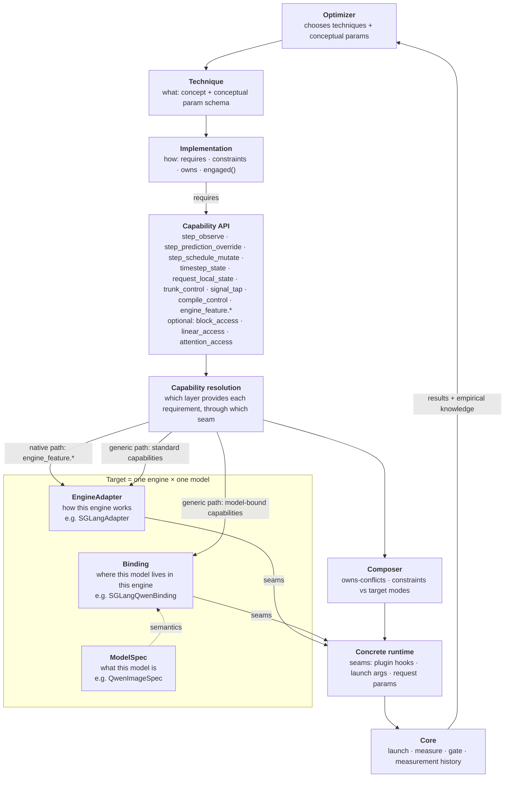

# Architecture

Status: current · last substantive update 2026-10-01

This is the current design, and the place where its terms are defined. Why
each part is shaped this way is in the ADRs
([0008](adr/0008-capability-layer.md), [0009](adr/0009-lifecycle-constraints.md),
[0010](adr/0010-v1-capabilities-and-first-techniques.md),
[0011](adr/0011-split-step-control.md)). The evidence from
SGLang's code is in the [investigation](architecture-investigation.md).

## In short

- The optimizer picks **techniques**, like "TeaCache" or "FP8". It never
  needs to know how an engine or a model is built.
- Each technique has one or more **implementations**. An implementation says
  which abstract **capabilities** it needs, for example "control each
  denoising step" or "run or replay the transformer trunk".
- A **target** is one engine running one model, such as SGLang running
  Qwen-Image. It answers those needs from three places:
  - what the engine does for every model (**EngineAdapter**);
  - what the model is in any engine (**ModelSpec**);
  - where this model lives inside this engine (**Binding**).
- Each capability is answered by whichever place can provide it. This
  **capability resolution** is why a simple technique never touches
  model-specific code.

## The picture

## A walk through one example

Follow **TeaCache on Qwen-Image in SGLang** from top to bottom:

1. The **optimizer** chooses technique `teacache` with a threshold.
2. The implementation `fractalyze-teacache` says it needs four capabilities:
   - the current step and timestep;
   - somewhere to keep state for this request;
   - a way to run or replay the transformer trunk;
   - a cheap signal that predicts whether the trunk's output will change.
3. **Resolution** finds who provides each one:
   - The step, timestep and request state are the same for every model in
     SGLang, so **SGLangAdapter** provides them.
   - The trunk and the signal live in different places in every model, so
     **SGLangQwenBinding** provides them. It knows that Qwen's trunk is the
     `transformer_blocks` loop, and that the signal is the first block's
     modulation.
   - **QwenImageSpec** contributes what is true of Qwen in any engine: it
     uses true CFG, so TeaCache keeps separate state per CFG branch.
4. The **composer** checks the combination. TeaCache makes decisions inside
   the transformer, so it is refused if graph capture is on.
5. The concrete runtime runs it. SGLang loads our plugin in its GPU worker,
   and the plugin attaches at the seams the adapter and binding named.
6. **Core** measures speed and quality, checks that TeaCache really skipped
   steps, and records the result. The optimizer uses it to pick the next try.

Step skip, by contrast, needs only to observe steps, override a step's
prediction, and keep request state. It resolves
entirely in SGLangAdapter and never touches a Binding. That difference is the
point of resolution.

## Terms

**Technique.** An optimization idea. It is defined by three things: the
signal it decides from, the rule it decides with, and what it reuses or
replaces. It also has a schema of *conceptual* parameters. Two
implementations are the same technique only if all three match. That is why
cache-dit's block cache is not "TeaCache".

**Implementation.** One concrete way to realize a technique. It is either:
- **native:** it switches on a feature the engine already has, e.g.
  `sglang-native-fp8`;
- **generic:** our own code, written against capabilities, e.g.
  `fractalyze-teacache`.

Both kinds follow the same [contract](#implementation-contract).

**Capability.** An abstract operation an implementation needs, described by
what it lets you do and not by where it lives. Example:
`step_prediction_override` means "return your own prediction for a denoising
step instead of calling the model".

**Seam.** The concrete place where one target provides a capability.
Example: SGLang's `DenoisingStage._run_denoising_step`, reached through a
plugin hook. Seams are private to adapters and bindings, and implementations
never name them. If they did, our "generic" code would really be SGLang code.

**EngineAdapter.** Everything about one engine that is the same for all
models: how its worker processes start, how we inject code into them, where
per-request state lives, when it compiles and records graphs, its shared
denoising loop, and its built-in features. Example: `SGLangAdapter`.

**ModelSpec.** What a model family *is*, true in every engine. Examples:
whether it uses true CFG, how it scales timesteps, how its text and image
streams are arranged. It holds no measured numbers. Example: `QwenImageSpec`.

**Binding.** Glue that only makes sense for one engine × model pair. It says
where a logical part, like "the trunk", lives in that engine's version of the
model, and translates the engine's native state into a capability's standard
form. It sits between EngineAdapter and ModelSpec and replaces neither.
Example: `SGLangQwenBinding`.

**Measurement history.** Everything learned by measuring: good thresholds,
fitted coefficients, layers that are sensitive to precision, the quality cost
of a setting. These depend on model, technique, implementation, hardware,
workload and quality gate together, so they are *not* model facts. In V1 this
is simply what Core records; there is no separate type.

## Where knowledge belongs

Ask in this order:

1. Is it **measured** rather than derived from the architecture? It goes in
   **measurement history**.
2. Is it the **same for many models** in one engine? It goes in the
   **EngineAdapter**.
3. Is it **true of the model in every engine**? It goes in the **ModelSpec**.
4. Does it **only make sense for one engine × model pair**? It goes in the
   **Binding**.

One exception: when the engine already records a per-model fact itself (an
allowlist, a registry), the EngineAdapter reads it from the engine instead of
copying it.

The rule, tested on real cases:

| Fact | Belongs in | Because |
|---|---|---|
| SGLang's denoising loop and CFG handling | EngineAdapter | shared engine code for every model |
| where per-request state lives in SGLang | EngineAdapter | an engine mechanism |
| SGLang compiles at pipeline build and records graphs at warmup | EngineAdapter | the engine's lifecycle |
| Qwen scales timesteps by 1/1000 and uses true CFG with rescaling | ModelSpec | true in the reference implementation too |
| FLUX runs double-stream blocks, then single-stream blocks | ModelSpec | an architecture fact |
| Qwen's trunk is the `transformer_blocks` loop in SGLang's model file | Binding | a location inside SGLang's version |
| SGLang's FLUX.2 joins the streams once and its single blocks return one tensor | Binding | how *this engine* built that architecture |
| TeaCache coefficients, good thresholds, sensitive layers | measurement history | fitted or measured |
| graph capture is allowed for Qwen but not FLUX.2 | EngineAdapter | SGLang keeps the allowlist itself |

**Cases that split across owners:**
- **Finding linear layers.** "Every SGLang linear has a swappable
  `quant_method`" is engine knowledge. "Qwen-Image-2.1 uses plain PyTorch
  linears for a few layers, and FLUX.2 merges two projections into one" is
  Binding knowledge.
- **Block topology.** "FLUX has double then single blocks" is ModelSpec. "In
  SGLang the single blocks run after a one-time join" is Binding.

## Implementation contract

Every field is here because a real problem in SGLang's code needs it.

| Field | What it says | The problem it handles |
|---|---|---|
| `id`, `technique` | which technique this realizes | one technique can have a native and a generic implementation |
| `kind` | native or generic | they are selected and verified differently |
| `params` | the technique's conceptual parameters, plus its own extras | TeaCache's threshold is conceptual; its coefficients are model-specific |
| `requires` | the capabilities it needs | decides whether it can run on a target at all |
| `constraints` | when it must be installed and what it can survive (three flags, [ADR 0009](adr/0009-lifecycle-constraints.md)) | some changes must precede compilation; some decisions vanish under graph capture |
| `owns` | resources it needs exclusively | FP8 and NVFP4 both want the linear layers; TeaCache and cache-dit both want the trunk |
| `engaged()` | evidence that it really ran | an optimization that silently did nothing must not report a speedup |

There is deliberately no list of supported targets. Resolution computes
that, so nobody maintains it by hand.

### Choosing between implementations

1. Drop every implementation whose capabilities this target cannot provide.
2. Default order:
   1. a native implementation that has already **passed the quality gate on
      this target**;
   2. a generic implementation;
   3. any other native implementation.
3. Nothing left means the technique is unsupported on this target.

This is a default, not a law. When both a native and a generic version
resolve, the optimizer can measure both.

## Three techniques, resolved

| | Step skip | TeaCache | FP8 linear |
|---|---|---|---|
| **Implementation** | `fractalyze-step-skip` (generic) | `fractalyze-teacache` (generic) | `sglang-native-fp8` (native) |
| **Needs** | step observe, step prediction override, request state | timestep, request state, trunk control, signal tap | the engine's FP8 feature |
| **Provided by** | SGLangAdapter only | SGLangAdapter + per-model Binding | SGLangAdapter only |
| **Model-specific code** | none | where the trunk and signal are | none |
| **Installed** | per request; no reload | trunk wrapper before compile; state per request | at server launch |
| **Decides** | every step, outside the transformer | every step, inside the transformer | never (static) |
| **Constraints** | `request_state` | `mutates_model`, `dynamic_in_forward`, `request_state` | `mutates_model` |
| **Exclusive resource** | the step's prediction | the trunk | the linear layers |
| **Graph capture** | safe (verified on Qwen-Image-2.1, [exp 001](../experiments/001-step-control/README.md)) | refused | handled by the engine |
| **How we check it ran** | count skipped steps | count reused trunk calls | count FP8 layers in the live model |

The decomposition is natural for all three. It gets harder the moment we
want *selective* FP8, keeping some layers in full precision. That needs a
generic implementation with `linear_access`, which needs a Binding to name
the layer groups. This is why `linear_access` stays a capability rather than
just an engine flag.

## Capabilities in V1

| Capability | Status | In SGLang, provided by | …at this seam |
|---|---|---|---|
| `step_observe` | common | SGLangAdapter | `_run_denoising_step` (`denoising.py:1626`) |
| `step_prediction_override` | common | SGLangAdapter | `_predict_noise_with_cfg` (`denoising.py:2195`) |
| `step_schedule_mutate` | common | SGLangAdapter | `TimestepPreparationStage.forward` (`timestep_preparation.py:78`) |
| `timestep_state` | common | SGLangAdapter | step state; forward context |
| `request_local_state` | common | SGLangAdapter | the request object; which CFG branch is running |
| `trunk_control` | common, per Binding | Binding | the block loop(s) in each model's forward |
| `signal_tap` | common, per Binding | Binding | e.g. the first block's modulation |
| `engine_feature.*` | per engine | SGLangAdapter | launch flags, environment, per-request switches |
| `compile_control` | per engine | SGLangAdapter | compile and graph-capture flags |
| `block_access` | **optional** | Binding, if it can | the target's own block list and signature |
| `linear_access` | **optional** | SGLangAdapter + Binding | swappable `quant_method` + named layer groups |
| `attention_access` | **optional** | SGLangAdapter | attention backend selector |

"Optional" means a target may not provide it, in which case implementations
that need it are unsupported there. It does not mean the idea was rejected.
Block-level access in particular is expected to be needed later, for
selective block caching, block skipping and per-block precision. It just has
no shared signature across models.

## What is settled, what is open

**Settled by the investigation** (decisions and rejected alternatives are in
the ADRs):
- Implementations depend on capabilities, never on seams.
  [ADR 0008](adr/0008-capability-layer.md)
- EngineAdapter, ModelSpec and Binding are separate.
  [ADR 0008](adr/0008-capability-layer.md)
- Measured values live in measurement history, not in ModelSpec.
  [ADR 0008](adr/0008-capability-layer.md)
- Implementations declare three constraints; SGLang's lifecycle stages stay
  inside SGLangAdapter. [ADR 0009](adr/0009-lifecycle-constraints.md)
- Block access is optional and target-specific, not rejected.
  [ADR 0010](adr/0010-v1-capabilities-and-first-techniques.md)
- Step control needs no Binding, and is three capabilities: observe, override
  a prediction, mutate the schedule. Skipping a whole step is not offered,
  because it desyncs the scheduler. All three survive graph capture.
  [ADR 0011](adr/0011-split-step-control.md),
  [experiment 001](../experiments/001-step-control/README.md)

**Open until an experiment answers it:**
- Do the step capabilities map cleanly onto vLLM-Omni's and ComfyUI's
  denoising loops?
- Can one generic TeaCache serve both Qwen-Image and FLUX.2 through their
  Bindings?
- Does a trunk wrapper survive torch.compile, and at what cost?
- Does linear replacement need a Binding in practice?
- What capabilities does ComfyUI need, given that it executes node graphs?

The experiments that test these are listed, cheapest-to-falsify first, in the
[investigation](architecture-investigation.md#open-items).

**Deliberately not generalized yet:**
- **Lifecycle.** There is no cross-engine lifecycle model, only three
  constraint flags that each adapter maps onto its own lifecycle.
- **Blocks.** There is no universal block signature, and V1 has no
  block-level technique.
- **vLLM-Omni and ComfyUI.** No adapter exists beyond the rule "provide
  capabilities through seams". How many capabilities they can provide is an
  experiment, not an assumption.
