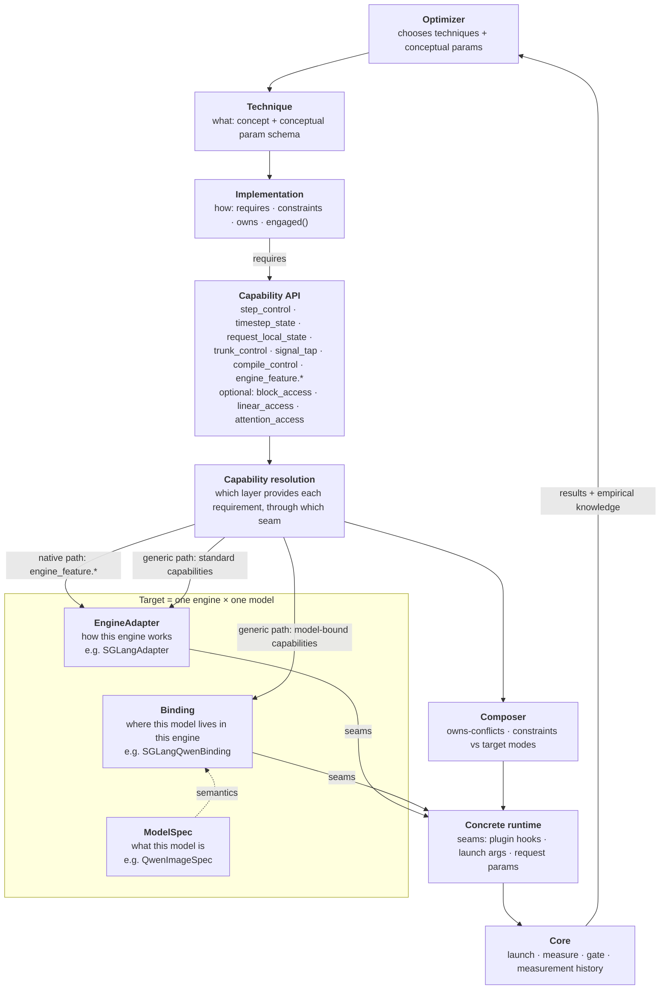

# Architecture

Status: current · last substantive update 2026-10-01

Scope: this document owns the definitions of the architecture's concepts, the
rule for where knowledge belongs, and how a technique gets resolved onto a
concrete runtime. The evidence behind it is the
[SGLang investigation](architecture-investigation.md). The decisions and the
alternatives they replaced are in
[ADR 0008](adr/0008-capability-layer.md),
[ADR 0009](adr/0009-lifecycle-constraints.md) and
[ADR 0010](adr/0010-v1-capabilities-and-first-techniques.md).

All SGLang references are to upstream `sgl-project/sglang` @ `8ca82118e`,
with paths relative to `python/sglang/multimodal_gen/`.

## The picture



Not every technique passes through every layer. Each capability an
implementation requires is resolved by whichever layer can provide it.
**Capability resolution** is that mapping, and it is a first-class step.

## Core concepts

| Concept | Definition | Example |
|---|---|---|
| **Technique** | An optimization *concept*: a decision signal, a decision rule, and the payload it reuses or replaces, plus a schema of conceptual parameters. Two implementations belong to the same technique only if all three match. | `teacache` (signal: rel-L1 of the timestep-modulated input; rule: accumulated threshold; payload: trunk residual) |
| **Implementation** | One concrete way to realize a technique, with the contract in [Implementation contract](#implementation-contract). Either *native* (configures an engine feature) or *generic* (our code, written against capabilities). | `sglang-native-fp8`, `fractalyze-teacache` |
| **Capability** | An abstract operation an implementation needs, defined by *what it allows*, independent of any engine. | `step_control`: observe each denoising step and decide whether to compute, reuse or replace the noise prediction |
| **Seam** | Where and how a concrete target exposes a capability. Seams are private to EngineAdapters and Bindings; implementations never name them. | SGLang `DenoisingStage._run_denoising_step` (`denoising.py:1626`), reached by a `sglang.multimodal_gen.plugins` AROUND hook |
| **EngineAdapter** | Knowledge common to one engine across all models: worker/process lifecycle, injection mechanism, request-local state, compile and graph-capture timing, the shared denoising loop, native feature configuration. | `SGLangAdapter` |
| **ModelSpec** | Model-family *semantics* that hold in every engine: CFG semantics, timestep conventions, architecture family, token and stream semantics. No measured values. | `QwenImageSpec`: true CFG with norm-rescale; timestep scaled by 1/1000; dual-stream blocks |
| **Binding** | Glue that exists only for one engine × model pair: where a logical component lives in that engine's implementation of the model, and the translation between native state and a capability's standard context. It sits between the other two and replaces neither. | `SGLangQwenBinding`: the trunk is `transformer_blocks` iterated at `qwen_image.py:2443` |
| **Measurement history** (empirical knowledge) | What Core has measured: results keyed by model × technique × implementation × params × hardware × workload × gate. Thresholds, coefficients, sensitive layers and FP8-safe ranges are *observations* and live here. In V1 this is just Core's trace and frontier records, not a new type. | "`fractalyze-teacache` at threshold 0.08 on Qwen-Image passed the gate at 1.6x" |

### Capability vs seam

The distinction is kept because the investigation shows the same capability
being provided by different layers through different seams:

- `step_control` is provided **engine-wide**. SGLang's denoising loop is shared
  by Qwen and FLUX (`denoising.py:2037`), so `SGLangAdapter` provides it once.
- `trunk_control` is provided **per model**. The trunk is a different loop in
  each DiT (`qwen_image.py:2443`; `flux_2.py:1724-1760`), so each Binding
  provides it.

If implementations depended on seams directly, a generic implementation would
be SGLang code. A vLLM-Omni or ComfyUI target would then have to be written
from scratch rather than resolved. Seams also change across engine versions
without the capability changing. One seam can serve several capabilities, and
one capability can have alternative seams (`_run_denoising_step` or
`_predict_noise_with_cfg`).

## Ownership rule

> Shared by many models within one engine → **EngineAdapter**.
> True of the model in every engine → **ModelSpec**.
> Only meaningful for one engine × model pair → **Binding**.
> Measured rather than derived from architecture → **measurement history**.
> When the engine itself already encodes a per-model fact (an allowlist, a
> registry), the EngineAdapter *reads it from the engine* instead of copying it
> into a Binding.

Tested against the investigation:

| Fact | Owner | Why |
|---|---|---|
| SGLang's denoising loop and CFG dispatch | EngineAdapter | `DenoisingStage` is shared engine code for every model |
| Request-local state (`Req`, forward context, `ctx.extra`) | EngineAdapter | engine mechanism, model-independent |
| torch.compile at pipeline build; graph capture at warmup | EngineAdapter | engine lifecycle (`denoising.py:380`, `runner.py:575`) |
| Qwen: timestep / 1000, true CFG + norm-rescale | ModelSpec | holds in the reference implementation, not just SGLang's |
| FLUX family: double-stream blocks then single-stream blocks | ModelSpec | architecture family fact |
| Qwen's trunk = `transformer_blocks` loop at `qwen_image.py:2443` | Binding | a path inside SGLang's reimplementation |
| FLUX.2 in SGLang: join once, single blocks return one tensor, lazy gated-residual tuples | Binding | how *this engine* realized that architecture |
| TeaCache coefficients; sensitive layers; good thresholds | Measurement history | fitted or measured, depends on hardware, workload and gate |
| Breakable CUDA graph allowed for Qwen but not FLUX.2 | EngineAdapter (reads `server_args.py:234`) | the engine owns the allowlist |

Ambiguous cases, and how they are handled:

- **Linear module discovery.** It is split. *Finding* linears is engine-wide:
  every SGLang linear is a `LinearBase` with a `quant_method`
  (`layers/linear.py:219`). *Which* linears form a logical group, and the
  exceptions, are Binding facts. Qwen-Image-2.1 uses plain `nn.Linear` for
  `img_in`/`proj_out`/modulation; FLUX.2 merges QKV and MLP into one GEMM.
- **Block topology.** It is split. "FLUX has double then single blocks" is
  ModelSpec. "In SGLang the single blocks run after `join_seqs` and return one
  tensor" is Binding.
- **Native feature availability per model.** Owned by EngineAdapter when the
  engine encodes it (BCG allowlist, cache-dit's registry). It becomes a
  Binding fact only if we discover availability the engine does not declare.

## Implementation contract

Each field is here because a concrete issue in the investigation needs it.

| Field | Meaning | Needed because |
|---|---|---|
| `id`, `technique` | identity | the same technique has native and generic implementations (cache-dit vs ours) |
| `kind` | `native` or `generic` | selection default and engagement evidence differ |
| `params` | conceptual params (from the technique) plus implementation extras | TeaCache's threshold is conceptual; its rescale coefficients are implementation- and model-specific |
| `requires` | set of capabilities, including `engine_feature.*` | resolution: decides feasibility per target |
| `constraints` | lifecycle and execution needs, see [ADR 0009](adr/0009-lifecycle-constraints.md) | must precede compile; Python control flow is lost on graph replay; per-request state reset |
| `owns` | exclusive resources | NVFP4 vs FP8 on `linear.quant`; TeaCache vs cache-dit vs Spectrum on `trunk.forward`; CFG gate vs CFG-parallel on `cfg.branch` |
| `engaged(evidence)` | proof it actually ran | a no-op must not report a speedup (Sol's authenticity gate) |

There is deliberately **no `supported_targets` field**. Support is the result
of resolving `requires` against a target, so it is never hand-maintained.

### Implementation selection

1. Resolve each implementation of the chosen technique against the target.
   Drop those with unresolved requirements.
2. Default order: a native implementation already **validated on this target**
   in measurement history; then a generic implementation; then any unvalidated
   native implementation; otherwise *unsupported*.
3. The default is a starting point, not a rule. Where both a native and a
   generic implementation resolve, the optimizer may measure both as separate
   arms.

Evidence for "validated native first": native cache-dit already handles its own
ordering against compile (`denoising.py:544`). Evidence against making it a
hard rule: native implementations can exist and silently do nothing. SGLang's
TeaCache mixin exists on every `CachableDiT` but Qwen and FLUX never call it,
and Spectrum under graph capture replays without its branch.

## Capability resolution examples

### Step skip

```
fractalyze-step-skip (generic)
  requires: step_control, timestep_state, request_local_state
  resolution: all three → SGLangAdapter (shared denoising loop, DenoisingStepState, Req)
  Binding: none.  ModelSpec: none.
  constraints: request_state   (mutates_model: no · dynamic_in_forward: no)
  owns: step.prediction
```

- **Install:** request init. No reload, so configs that differ only in step
  skip can share one running server.
- **Runtime:** per step, outside the DiT call.
- **Compile:** unaffected, because the loop is outside the compiled module.
- **Graph capture:** expected to be safe. Graphs are replayed per DiT call
  (`denoising.py:2500`, `runner.py:300`), so skipping a step skips a replay.
  Unverified; see experiment 1.

### TeaCache

```
fractalyze-teacache (generic)
  requires: timestep_state, request_local_state   → SGLangAdapter
            trunk_control, signal_tap            → SGLangQwenBinding / SGLangFlux2Binding
  consults: ModelSpec (timestep convention; CFG semantics → per-branch state)
  params:   threshold, warmup (conceptual); coefficients (from measurement history)
  constraints: mutates_model (wraps the trunk), dynamic_in_forward, request_state
  owns: trunk.forward
```

- **Install:** the trunk wrapper goes in before compile. State is reset at
  request init.
- **Runtime:** per step, *inside* the DiT. Its control flow is therefore not
  replayable under graph capture, and it is **rejected when graph capture is
  on**.
- **Compile:** its host sync forces a graph break. Whether it survives
  torch.compile is open (experiment 2).
- **Conflicts:** cache-dit, Spectrum, and any other owner of `trunk.forward`.

### FP8 linear

```
sglang-native-fp8 (native)
  requires: engine_feature.fp8_linear → SGLangAdapter (--quantization fp8)
  Binding: none.  Generic seams: none.
  constraints: mutates_model (decided at module construction)
  owns: linear.quant
```

- **Install:** at launch and construction, so a different FP8 setting means a
  different server.
- **Runtime:** static.
- **Engagement:** count the live `quant_method`s that are FP8.
- **Compile:** the engine orders it before compile itself.

The decomposition is natural for the native case. It gets *unnatural* as soon
as we want **selective** FP8, meaning some layers kept dense. That needs a
generic implementation requiring `linear_access`, which in turn needs a Binding
for logical groups and exceptions. This is evidence that `linear_access` must
stay a resolvable capability, not just an engine flag.

## Capabilities in V1

| Capability | Status | Provided by (SGLang) | Seam (SGLang) |
|---|---|---|---|
| `step_control` | common | SGLangAdapter | `_run_denoising_step` (`denoising.py:1626`) |
| `timestep_state` | common | SGLangAdapter | `DenoisingStepState`; forward context `current_timestep` |
| `request_local_state` | common | SGLangAdapter | `Req`, `ctx.extra`, `Req.is_cfg_negative` for the branch |
| `trunk_control` | common (per Binding) | Binding | the block loop(s) in each DiT forward |
| `signal_tap` | common (per Binding) | Binding | e.g. first block's modulation |
| `engine_feature.*` | per engine | SGLangAdapter | launch args, env, request sampling params |
| `compile_control` | per engine | SGLangAdapter | `--enable-torch-compile`, `--enable-breakable-cuda-graph` |
| `block_access` | **optional** | Binding (if it can) | target-specific block list and signature; no universal signature |
| `linear_access` | **optional** | SGLangAdapter + Binding | `LinearBase.quant_method` + Binding's logical groups |
| `attention_access` | **optional** | SGLangAdapter | backend selector (`selector.py:171`) |

"Optional" means a target may decline to provide it, and implementations that
require it are then unsupported on that target. It does not mean the concept
is rejected.

## Changes made now (backed by the investigation)

- The **capability layer** is restored: implementations depend on capabilities;
  seams are private to targets.
- **Binding is glue** between EngineAdapter and ModelSpec, and replaces
  neither.
- An explicit **ownership rule**, including the cases where knowledge is
  split.
- **Block-level access is optional and target-specific.** It is not rejected.
- **Empirical knowledge** moves out of ModelSpec into measurement history.
- **Lifecycle:** SGLang's phases are SGLang-specific and stay inside
  `SGLangAdapter`. Implementations declare constraints instead
  ([ADR 0009](adr/0009-lifecycle-constraints.md)).
- **Step-seam policies** are expected to be compatible with graph capture.
  Only in-DiT policies are excluded.

## Open questions requiring experiments

These are deliberately not answered here.

- Does `step_control` map cleanly onto vLLM-Omni's and ComfyUI's denoising
  loops?
- Can one generic TeaCache implementation serve both Qwen-Image and FLUX.2
  through their Bindings?
- Does a Binding-provided trunk wrapper survive torch.compile, and at what
  graph-break cost?
- Are step-seam policies really safe under breakable CUDA graph replay?
- Does linear replacement need a Binding in practice, or does
  `LinearBase.quant_method` suffice for both models?
- What capability set does ComfyUI need, given that its unit of execution is a
  node graph?

## Not generalized yet, on purpose

- **Lifecycle.** No cross-engine lifecycle model. Implementations carry three
  constraint flags; only `SGLangAdapter` maps them to phases.
- **Blocks.** No universal block signature and no block-level technique in
  V1. `block_access` is a named, optional capability so it can be added later.
- **vLLM-Omni and ComfyUI.** No adapter interfaces are defined beyond "provides
  capabilities through seams". Their capability coverage is an experiment,
  not an assumption.
