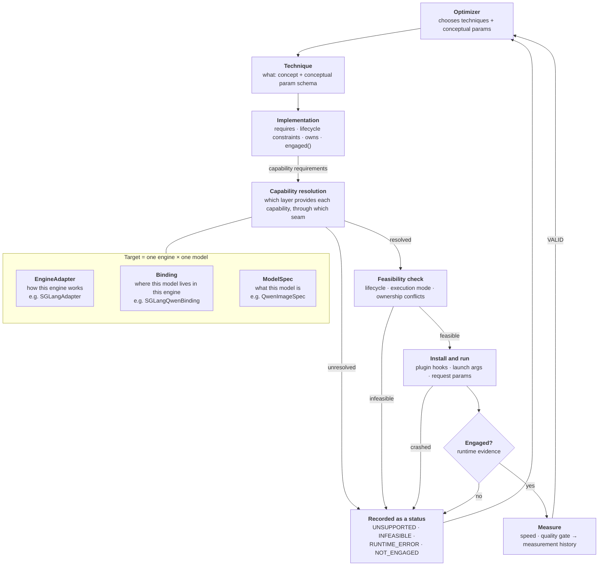

# Architecture

Status: current · last substantive update 2026-10-02

This is the current design, and the place where its terms are defined. Why
each part is shaped this way is in the ADRs
([0008](adr/0008-capability-layer.md), [0009](adr/0009-lifecycle-constraints.md),
[0010](adr/0010-v1-capabilities-and-first-techniques.md),
[0011](adr/0011-split-step-control.md),
[0012](adr/0012-trunk-capabilities.md),
[0013](adr/0013-feasibility-and-engagement.md)). The evidence from
SGLang's code is in the [investigation](architecture-investigation.md).

## In short

- The optimizer picks **techniques**, like "TeaCache" or "FP8". It never
  needs to know how an engine or a model is built.
- Each technique has one or more **implementations**. An implementation says
  which abstract **capabilities** it needs, for example "override a denoising
  step's prediction" or "replace the transformer trunk's output".
- A **target** is one engine running one model, such as SGLang running
  Qwen-Image. It answers those needs from three places:
  - what the engine does for every model (**EngineAdapter**);
  - what the model is in any engine (**ModelSpec**);
  - where this model lives inside this engine (**Binding**).
- Each capability is answered by whichever place can provide it. This
  **capability resolution** is why a simple technique never touches
  model-specific code.
- Being provided is not enough. Before a run, a **feasibility check** asks
  whether the capabilities are usable in the **execution mode** the engine
  actually applied (eager, compiled, graph-replayed). After a run,
  **engagement verification** asks whether the optimization really executed.
  Only an engaged run is a measurement.

## The picture

## A walk through one example

This is the canonical example: **TeaCache in SGLang**, on Qwen-Image-2.1 or
FLUX.2-klein. Everything below except the measured numbers was exercised in
[experiment 002](../experiments/002-trunk-control/README.md).

1. **Technique.** The optimizer chooses `teacache` with a threshold.
2. **Implementation.** `fractalyze-teacache` requires:
   - `timestep_state`: the current step and how many there are;
   - `execution_local_state`: state for this request and CFG branch only;
   - `signal_observe`: a cheap signal that predicts whether the trunk's
     output will change;
   - `trunk_observe` and `trunk_output_override`: see every trunk call, and
     on a reuse, supply the stored result instead of running the trunk.
3. **Resolution.**
   - **SGLangAdapter** provides the step, the timestep, the per-item state, and
     the mechanics shared by every model: opening a trunk call, stopping blocks
     from running, replacing the trunk's output, packing payloads.
   - **SGLangQwenBinding** provides where Qwen-Image-2.1's trunk starts and ends
     (the `transformer_blocks` loop; the output norm), what a skipped block
     returns, the signal (the first block's modulated input), and one invariant:
     the first call fills a prefix cache, so it must always run.
   - **SGLangFluxBinding** provides the same for FLUX.2: double-stream blocks,
     a one-time join, single-stream blocks, then the output norm.
   - **ModelSpec** contributes what is true in any engine, e.g. FLUX.2 uses true
     CFG, so state is kept per branch.
4. **Feasibility** ([ADR 0013](adr/0013-feasibility-and-engagement.md)).
   `trunk_output_override` is a *decide* capability whose seam is inside the
   model's forward, so the execution mode matters:

   | Applied mode | Trunk seams are | Qwen-Image-2.1 | FLUX.2 |
   |---|---|---|---|
   | eager | `live` | feasible | feasible |
   | regional compile | `traced` | feasible (identity check passed) | not offered by SGLang |
   | whole-model compile | `traced` | feasible (identity check passed) | **infeasible** (identity check failed) |
   | breakable CUDA graphs | `bypassed` | **infeasible** | not offered by SGLang |

   Lifecycle: the hooks must be in place before the model is built
   (`mutates_model`), and state is set up per item (`request_state`).
   Conflicts: TeaCache owns the trunk, so cache-dit cannot run with it.
5. **Run.** SGLang loads the plugin in its GPU worker; the hooks attach at the
   seams the adapter and Binding named.
6. **Engagement.** TeaCache's `engaged()` checks, from the adapter's counters,
   that it saw every trunk call of the request and that on every reuse it
   decided, the trunk's blocks did not run. Under graph replay it saw 1 call
   of 40, so the run is `NOT_ENGAGED`, not a "no speedup" result.
7. **Measure.** Only a `VALID` run is measured for speed and quality and
   recorded; the threshold that worked is measurement history, per model.

Step skip, by contrast, needs only `step_observe`,
`step_prediction_override` and per-item state. It resolves entirely in
SGLangAdapter, never touches a Binding, and its seams stay `live` in every mode
tested. That difference is the point of resolution.

## Terms

**Technique.** An optimization idea. It is defined by three things: the
signal it decides from, the rule it decides with, and what it reuses or
replaces. It also has a schema of *conceptual* parameters. Two
implementations are the same technique only if all three match. That is why
cache-dit's block cache is not "TeaCache".

**Implementation.** One concrete way to realize a technique. It is either:
- **native:** it switches on a feature the engine already has, e.g.
  `sglang-native-fp8`;
- **generic:** our own code, written against capabilities, e.g.
  `fractalyze-teacache`.

Both kinds follow the same [contract](#implementation-contract).

**Capability.** An abstract operation an implementation needs, described by
what it lets you do and not by where it lives. Example:
`step_prediction_override` means "return your own prediction for a denoising
step instead of calling the model".

**Seam.** The concrete place where one target provides a capability.
Example: SGLang's `DenoisingStage._run_denoising_step`, reached through a
plugin hook. Seams are private to adapters and bindings, and implementations
never name them. If they did, our "generic" code would really be SGLang code.

**EngineAdapter.** Everything about one engine that is the same for all
models: how its worker processes start, how we inject code into them, where
per-request state lives, when it compiles and records graphs, its shared
denoising loop, and its built-in features. Example: `SGLangAdapter`.

**ModelSpec.** What a model family *is*, true in every engine. Examples:
whether it uses true CFG, how it scales timesteps, how its text and image
streams are arranged. It holds no measured numbers. Example: `QwenImageSpec`.

**Binding.** Glue that only makes sense for one engine × model pair. It says
where a logical part, like "the trunk", lives in that engine's version of the
model, and translates the engine's native state into a capability's standard
form. It sits between EngineAdapter and ModelSpec and replaces neither.
Example: `SGLangQwenBinding`.

**Execution mode.** How the engine actually runs the model for this target:
for SGLang, the compile scope and the graph mode it *applied*, read back from
the engine rather than taken from the request. It is private to the
EngineAdapter.

**Interception state.** What happens, in the current execution mode, to code
placed at one seam: `live` (runs as Python on every call), `traced` (runs
inside compiled code), or `bypassed` (the call is replayed from a recording
and the seam never runs). This is the only execution-mode fact implementations
depend on, through feasibility.

**Feasible / engaged.** *Supported* means every required capability resolves
on the target. *Feasible* means it is also usable in the applied execution
mode, with lifecycle needs met and no ownership conflict. *Engaged* means the
run's own evidence shows the optimization executed. Configuration proves none
of these.

**Measurement history.** Everything learned by measuring: good thresholds,
fitted coefficients, layers that are sensitive to precision, the quality cost
of a setting. These depend on model, technique, implementation, hardware,
workload and quality gate together, so they are *not* model facts. In V1 this
is simply what Core records; there is no separate type.

## Where knowledge belongs

Ask in this order:

1. Is it **measured** rather than derived from the architecture? It goes in
   **measurement history**.
2. Is it the **same for many models** in one engine? It goes in the
   **EngineAdapter**.
3. Is it **true of the model in every engine**? It goes in the **ModelSpec**.
4. Does it **only make sense for one engine × model pair**? It goes in the
   **Binding**.

One exception: when the engine already records a per-model fact itself (an
allowlist, a registry), the EngineAdapter reads it from the engine instead of
copying it.

The rule, tested on real cases:

| Fact | Belongs in | Because |
|---|---|---|
| SGLang's denoising loop and CFG handling | EngineAdapter | shared engine code for every model |
| where per-request state lives in SGLang | EngineAdapter | an engine mechanism |
| SGLang compiles at pipeline build and records graphs at warmup | EngineAdapter | the engine's lifecycle |
| Qwen scales timesteps by 1/1000 and uses true CFG with rescaling | ModelSpec | true in the reference implementation too |
| FLUX runs double-stream blocks, then single-stream blocks | ModelSpec | an architecture fact |
| Qwen's trunk is the `transformer_blocks` loop in SGLang's model file | Binding | a location inside SGLang's version |
| Qwen-Image-2.1's first trunk call fills the prefix cache, so it must not be skipped | Binding | how *this engine* implements the model's text conditioning |
| SGLang's FLUX.2 joins the streams once and its single blocks return one tensor | Binding | how *this engine* built that architecture |
| TeaCache coefficients, good thresholds, sensitive layers | measurement history | fitted or measured |
| graph capture is allowed for Qwen but not FLUX.2 | EngineAdapter | SGLang keeps the allowlist itself |

**Cases that split across owners:**
- **Finding linear layers.** "Every SGLang linear has a swappable
  `quant_method`" is engine knowledge. "Qwen-Image-2.1 uses plain PyTorch
  linears for a few layers, and FLUX.2 merges two projections into one" is
  Binding knowledge.
- **Block topology.** "FLUX has double then single blocks" is ModelSpec. "In
  SGLang the single blocks run after a one-time join" is Binding.

## Implementation contract

Every field is here because a real problem in SGLang's code needs it.

| Field | What it says | The problem it handles |
|---|---|---|
| `id`, `technique` | which technique this realizes | one technique can have a native and a generic implementation |
| `kind` | native or generic | they are selected and verified differently |
| `params` | the technique's conceptual parameters, plus its own extras | TeaCache's threshold is conceptual; its coefficients are model-specific |
| `requires` | the capabilities it needs; each capability is an *observe* or a *decide* kind | decides whether it can run on a target at all, and in which execution modes |
| `constraints` | lifecycle needs: `mutates_model`, `request_state` ([ADR 0009](adr/0009-lifecycle-constraints.md)) | some changes must precede compilation; some need setup and cleanup per item |
| `owns` | resources it needs exclusively | FP8 and NVFP4 both want the linear layers; TeaCache and cache-dit both want the trunk |
| `engaged(evidence)` | a verdict and reason, from counters the adapter reports | an optimization that silently did nothing must not report a speedup |

**Execution-mode constraints are not declared.** They follow from `requires`:
an *observe* capability needs its seam not `bypassed`; a *decide* capability
needs it `live`, or `traced` with a passed identity check
([ADR 0013](adr/0013-feasibility-and-engagement.md)). A generic implementation
therefore never names an engine flag such as "graph capture off".

There is deliberately no list of supported targets. Resolution and feasibility
compute that, so nobody maintains it by hand.

### Choosing between implementations

1. Drop every implementation whose capabilities this target cannot provide
   (`UNSUPPORTED`).
2. Drop every implementation that is not feasible in the applied execution
   mode, with its lifecycle needs and the other chosen implementations
   (`INFEASIBLE`).
3. Default order among the rest:
   1. a native implementation that has already **passed the quality gate on
      this target**;
   2. a generic implementation;
   3. any other native implementation.
4. Nothing left means the technique cannot run on this target in this mode.

This is a default, not a law. When both a native and a generic version
remain, the optimizer can measure both.

### Every run ends in one status

| Status | Means |
|---|---|
| `UNSUPPORTED` | a required capability cannot be resolved |
| `INFEASIBLE` | lifecycle, execution mode or an ownership conflict rules it out |
| `RUNTIME_ERROR` | it crashed |
| `NOT_ENGAGED` | it ran, but its evidence does not show the optimization executed |
| `VALID` | engaged; the only status that becomes a speed and quality data point |

`NOT_ENGAGED` keeps "configured but never executed" apart from "executed and
gave no speedup", which the optimizer's search depends on.

## Three techniques, resolved

| | Step skip | TeaCache | FP8 linear |
|---|---|---|---|
| **Implementation** | `fractalyze-step-skip` (generic) | `fractalyze-teacache` (generic) | `sglang-native-fp8` (native) |
| **Needs** | step observe, step prediction override, per-item state | timestep, per-item state, trunk observe, trunk output override, signal observe | the engine's FP8 feature |
| **Provided by** | SGLangAdapter only | SGLangAdapter + per-model Binding | SGLangAdapter only |
| **Model-specific code** | none | where the trunk and signal are | none |
| **Installed** | per request; no reload | hooks at the trunk's edges before the model is built; state per request and CFG branch | at server launch |
| **Decides** | every step, outside the transformer | every step, inside the transformer | never (static) |
| **Lifecycle constraints** | `request_state` | `mutates_model`, `request_state` | `mutates_model` |
| **Exclusive resource** | the step's prediction | the trunk | the linear layers |
| **Feasible in (SGLang)** | every mode tested ([exp 001](../experiments/001-step-control/README.md)) | eager; compiled where the identity check passed; never under graph replay ([exp 002](../experiments/002-trunk-control/README.md)) | handled by the engine |
| **Engaged when** | DiT calls fell by the reuses decided | every trunk call seen, and blocks did not run on every reuse decided | the live model's linears report FP8 |

The decomposition is natural for all three. It gets harder the moment we
want *selective* FP8, keeping some layers in full precision. That needs a
generic implementation with `linear_access`, which needs a Binding to name
the layer groups. This is why `linear_access` stays a capability rather than
just an engine flag.

## Capabilities in V1

| Capability | Kind | Status | In SGLang, provided by | …at this seam |
|---|---|---|---|---|
| `step_observe` | observe | common | SGLangAdapter | `_run_denoising_step` (`denoising.py:1626`) |
| `step_prediction_override` | decide | common | SGLangAdapter | `_predict_noise_with_cfg` (`denoising.py:2195`) |
| `step_schedule_mutate` | decide | common | SGLangAdapter | `TimestepPreparationStage.forward` (`timestep_preparation.py:78`) |
| `timestep_state` | observe | common | SGLangAdapter | step state; forward context |
| `execution_local_state` | — | common | SGLangAdapter | the request object, keyed by CFG branch where needed |
| `trunk_observe` | observe | common, per Binding | SGLangAdapter + Binding | first block call (entry) and the output norm's input (exit) |
| `trunk_output_override` | decide | common, per Binding | SGLangAdapter + Binding | the same edges; blocks return their identity while overridden |
| `signal_observe` | observe | common, per Binding | Binding | e.g. the first block's modulated image input |
| `engine_feature.*` | — | per engine | SGLangAdapter | launch flags, environment, per-request switches |
| `compile_control` | — | per engine | SGLangAdapter | compile and graph-capture flags |
| `block_access` | — | **optional** | Binding, if it can | the target's own block list and signature |
| `linear_access` | — | **optional** | SGLangAdapter + Binding | swappable `quant_method` + named layer groups |
| `attention_access` | — | **optional** | SGLangAdapter | attention backend selector |

"Optional" means a target may not provide it, in which case implementations
that need it are unsupported there. It does not mean the idea was rejected.
Block-level access in particular is expected to be needed later, for
selective block caching, block skipping and per-block precision. It just has
no shared signature across models.

**Interception states in SGLang**, as measured:

| Seam | eager | regional compile | whole-model compile | breakable CUDA graphs |
|---|---|---|---|---|
| step seams (denoising loop) | `live` | `live` (code reading: only the blocks are compiled) | `live` | `live` |
| trunk edges (inside the DiT forward) | `live` | `traced` | `traced` | `bypassed`, except calls that fall back to eager |

Every cell except the one marked was measured in experiments
[001](../experiments/001-step-control/README.md) and
[002](../experiments/002-trunk-control/README.md).

## What a Binding may contain

A Binding is small and declarative, and that is an invariant, not a style
preference. It may contain:

- where a logical part, such as the trunk, starts and ends in this engine's
  version of the model;
- how the model's structures map to and from the generic forms (e.g. what a
  block returns when told not to compute);
- where a signal can be read, and how to compute it from the model's own
  inputs;
- invariants true only of this engine × model (e.g. Qwen-Image-2.1's first
  trunk call must always run).

It must not contain worker or request lifecycle, generic per-item state,
payload arithmetic, compile or graph-capture policy, benchmarking, or
engagement counting. When a Binding needs something a second model in the same
engine would also need, that code belongs in the EngineAdapter. A Binding that
keeps growing is turning into a god object. In
[experiment 002](../experiments/002-trunk-control/README.md) each Binding was a
list of class paths and four short functions.

## What is settled, what is open

**Settled** (decisions and rejected alternatives are in the ADRs):
- Implementations depend on capabilities, never on seams.
  [ADR 0008](adr/0008-capability-layer.md)
- EngineAdapter, ModelSpec and Binding are separate.
  [ADR 0008](adr/0008-capability-layer.md)
- Measured values live in measurement history, not in ModelSpec.
  [ADR 0008](adr/0008-capability-layer.md)
- Implementations declare two lifecycle constraints; SGLang's lifecycle
  stages stay inside SGLangAdapter. [ADR 0009](adr/0009-lifecycle-constraints.md)
- Block access is optional and target-specific, not rejected.
  [ADR 0010](adr/0010-v1-capabilities-and-first-techniques.md)
- Step control needs no Binding, and is three capabilities: observe, override
  a prediction, mutate the schedule. Skipping a whole step is not offered,
  because it desyncs the scheduler. All three survive graph capture.
  [ADR 0011](adr/0011-split-step-control.md),
  [experiment 001](../experiments/001-step-control/README.md)
- Trunk control needs a small per-model Binding and is three capabilities
  defined at the trunk's edges. Runtime evidence supports, for Qwen-Image-2.1
  and FLUX.2 in SGLang:
  1. one generic implementation works on both models;
  2. Bindings isolate the structural differences;
  3. whole-trunk operations travel better than a shared per-block interface;
  4. capabilities name operations, not hook mechanisms;
  5. the EngineAdapter / Binding split holds.
  [ADR 0012](adr/0012-trunk-capabilities.md),
  [experiment 002](../experiments/002-trunk-control/README.md)
- Feasibility includes the applied execution mode, and a run is a measurement
  only if it engaged. [ADR 0013](adr/0013-feasibility-and-engagement.md)

**Open until an experiment answers it:**
- **Logical ownership under batching.** When one model call serves several
  requests or CFG branches (vLLM-Omni batches requests; ComfyUI batches cond
  and uncond), can override, payload and signal act per item, and does
  `signal_observe` need a structured view that says which slice belongs to
  whom? To inspect later: in vLLM-Omni, request batching, per-request
  policies, how one call represents several requests; in ComfyUI, cond/uncond
  batching, ModelPatcher semantics, node-level versus forward-level control.
- Are three interception states enough for a second engine?
- Does a real cache policy built on these capabilities pay off, and with what
  thresholds per model?
- Does linear replacement need a Binding in practice?

The experiments that test these are listed, cheapest-to-falsify first, in the
[investigation](architecture-investigation.md#open-items).

**Deliberately not generalized yet:**
- **Lifecycle.** There is no cross-engine lifecycle model, only two
  constraint flags that each adapter maps onto its own lifecycle.
- **Execution mode.** There is no universal mode hierarchy. Each adapter keeps
  its own record of what the engine applied; only interception states are
  shared.
- **Blocks.** There is no universal block signature, and V1 has no
  block-level technique.
- **vLLM-Omni and ComfyUI.** No adapter exists. A code reading found a
  plausible seam for every capability in both; how many they can provide at
  runtime is an experiment, not an assumption.
