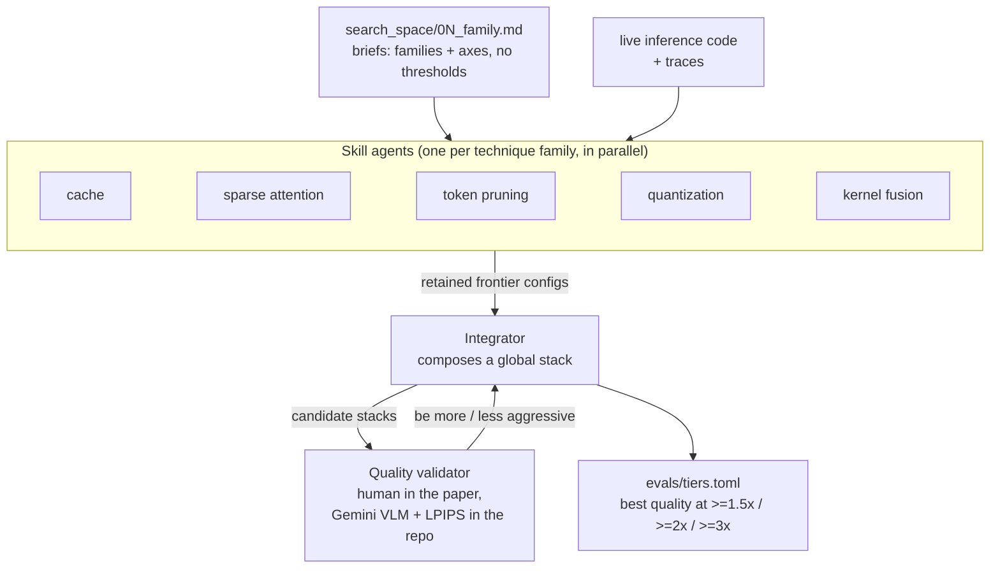

# Sol-Engine: the system this project is modeled on

Status: current · last substantive update 2026-10-01
Scope: what NVIDIA's Sol-Engine is, how its optimization loop works, and which
parts of it are public. Read this before an ADR that says "like Sol".

## In short

- Sol-Engine is NVIDIA's framework for speeding up video diffusion models,
  reporting 2-3x.
- A coding agent does the optimizing. One agent per technique family
  searches its own options. An integrator combines the winners. A quality
  judge (a person, or a vision model) decides what is acceptable.
- NVIDIA published the *rules*: config format, quality gates, technique
  catalog. It did not publish the *machinery*: the evaluation loop, the
  orchestration, the model adapters. That machinery is what this project
  builds.

## What it is

Sol-Engine lives on the `sol-engine` branch of
[NVlabs/Sana](https://github.com/NVlabs/Sana/tree/sol-engine)
([docs](https://nvlabs.github.io/Sana/Sol-Engine/docs/),
[paper, arXiv:2606.23743](https://arxiv.org/abs/2606.23743)). It is an
inference-acceleration framework for video diffusion models, built on a fork
of SGLang's `multimodal_gen` runtime. It reports 2-3x end-to-end speedups on
Cosmos3-Super, LTX-2.3, SANA-Video, Wan2.2 and LingBot-Video.

Everything below was read at commit `670482d` of that branch.

The defining property is that it is **agent-native**. A coding agent such as
Claude Code or Codex drives the search. Python only does the deterministic
parts: launching runs, measuring, gating, and auditing.

## The three tiers

Each skill agent runs a bounded loop: observe results, hypothesize, write
**one** config manifest, preflight, launch, gate, then retain or discard, and
loop again. The budget is `max_iters=40`. A config is retained if quality
*or* speed/memory improves. The loop exits as `terminal_pending_review`, and
the integrator picks the winners.

## What a config passes through

| Gate | Question it answers |
|---|---|
| `artifact` | Did the run produce the expected files? |
| `official_config` | Did it run the comparable model settings? |
| `performance` | Is it faster than the *stated* baseline? |
| `off_identity` | With the technique disabled, is the output the baseline's? |
| `quantitative_quality` | LPIPS against frozen baseline frames |
| `visual_artifact` | Does a VLM judge see new artifacts (rubric in `evals/rubrics/`)? |
| authenticity | Did the technique actually engage (stats written, steps reused)? |

## Layout of the public repo

| Path | Role |
|---|---|
| `search_space/01..06_*.md` | Per-family briefs: cache, token pruning, quantization, sparse attention, kernel fusion, parallel topology |
| `techniques/` | Model-agnostic policies (TeaCache, StepCache, PAB, token prune, sparse-attention masks, NVFP4 layer selection), plus `compose.py` for capability and seam-conflict checks |
| `config/<model>/<arm>.toml` | Config manifests: `id`, `kind` (baseline/patch/control), runtime, env flags, eval profile |
| `models/<id>.toml` | Model profile, i.e. the model-specific surface |
| `evals/` | Gates, eval profiles, `tiers.toml`, VLM rubric |
| `scripts/launch_config.py`, `collect_run.py` | Render and launch a run bundle; collect benchmark and quality JSON |
| `tools/fanout_audit.py` | Checks that a fan-out run ended in a terminal state with durable evidence |

## What is *not* public

The repo ships the **contract** but not the **loop**:

- `search/search.py:plan_eval()`, which runs the GPU evaluation and tiering, raises `NotImplementedError`.
- The fan-out loop contract and the orchestrator are described as "not published".
- The model adapters live in a separate SGLang runtime fork (`sglang-runtime/`) that is not included.

These missing pieces are the measurement loop, the orchestration, and the
adapters. They are what this project has to build itself. They are also the
area where earlier diffusion-optimization experiments were most expensive
to get right.
