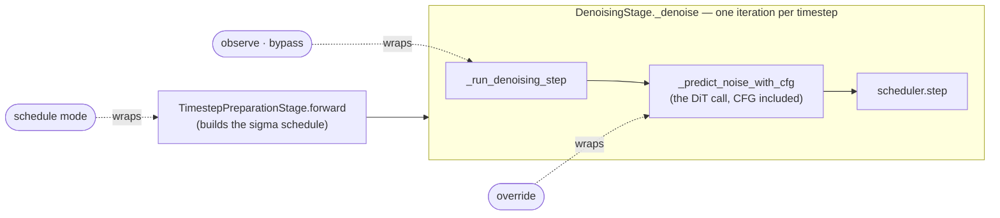

# Experiment 001: is step control an engine-level capability?

Status: done · 2026-10-01 · SGLang @ `8ca82118e` ([ADR 0003](../../docs/adr/0003-sglang-first-engine.md))
· outcome recorded in [ADR 0011](../../docs/adr/0011-split-step-control.md)

## In short

One SGLang plugin, with no model-specific code, observed and controlled every
denoising step of **Qwen-Image-2.1** and **FLUX.2-klein-base-4B**. The claim
"step control is an engine-level capability that needs no Binding" survives.
The claim that it is *one* capability does not:

- **Observing** steps and **replacing a step's prediction** are engine-wide and
  safe. Observation is bitwise identical to running without the plugin, in
  eager and under torch.compile, and adds no recompiles or graph breaks.
- **Skipping a whole step** is not a valid operation. The flow-match scheduler
  keeps its own step counter, so a skipped step silently shifts every later
  sigma by one (FLUX: 25.9 dB vs 39 dB for the correct alternatives).
- **Removing a step from the schedule** works, but only by editing the sigmas
  before the loop starts, which is scheduler knowledge.

So `step_control` is split into `step_observe`, `step_prediction_override` and
`step_schedule_mutate`, all provided by the EngineAdapter
([ADR 0011](../../docs/adr/0011-split-step-control.md)).

Not answered here: whether step control survives **graph capture**. FLUX.2 is
not on SGLang's breakable-CUDA-graph allowlist, and the Qwen graph runs were
dropped (see [Scope](#scope)).

## What was tested

The plugin (`opt_step_probe/plugin.py`) wraps three SGLang functions that every
diffusion pipeline here goes through. It never imports or names a model.



Each request picks one mode at step K (the middle step):

| Mode | What it does at step K | Question it answers |
|---|---|---|
| observe | nothing; log every step | does the probe itself perturb the output? |
| bypass | skip the whole step: no DiT call, no scheduler update | can a technique drop a step without scheduler knowledge? |
| override | reuse step K−1's prediction, still run the scheduler update | can a technique replace one step's prediction? |
| schedule | delete timestep K from the schedule before the loop | can a technique change the number of steps? |
| after-control | observe, after the controlled requests | does control leak into later requests? |

Each engine configuration is loaded once and serves all of its requests, so
per-request control is exercised inside one process.

## Results

Image differences are against the same configuration's own baseline without the
plugin; "identical" means every pixel matches. Times are client wall time per
image on one RTX 5090, median of the observe repeats.

**FLUX.2-klein-base-4B** · 50 steps · CFG 4.0 · 1024² · K = 25

| Engine mode | Baseline | observe | override | bypass | schedule | after-control |
|---|---|---|---|---|---|---|
| eager | 17.77 s | identical · 17.82 s | 49 calls · 39.2 dB | 49 calls · **desync** · 25.9 dB | 49 steps · 39.1 dB | identical |
| torch.compile | 17.58 s | identical | 49 calls · 36.9 dB | — | — | identical |
| BCG requested | 17.8 s (ran eager) | identical | 49 calls · 39.2 dB | — | — | identical |

The eager baseline matches the
[frontier benchmark's](https://frontier.fractalyze.io/flux-2-klein-4b/rtx5090)
`sglang-native` baseline (17.79 s, 19.9 GB peak VRAM; ours 20.0 GB) for the same
protocol settings, measured there on a different SGLang commit and prompt set.

**Qwen-Image-2.1** · 40 steps · CFG 1.0 · 1024² · K = 20 · eager only

| Baseline | observe | override | bypass | schedule | after-control |
|---|---|---|---|---|---|
| 13.62 s | identical · 13.77 s | 39 calls · 46.7 dB | 39 calls · **desync** · 31.2 dB | 39 steps · 46.7 dB | identical |

### Properties

| Property | Result | Evidence |
|---|---|---|
| no model-specific code | ✅ | one plugin file, both models |
| observation is transparent | ✅ | bitwise identical in eager and compile; +0.3% (FLUX) / +1.1% (Qwen) time |
| control is request-local | ✅ | after-control is bitwise identical on every run |
| override is safe | ✅ | one fewer DiT call, scheduler stays in step |
| bypass is safe | ❌ | scheduler desyncs from step K+1 on both models |
| schedule mutation works | ✅, with scheduler knowledge | sigmas must be rebuilt before the loop |
| survives torch.compile | ✅ | 21 recompiles and 134 graph breaks, with or without the plugin |
| survives graph capture | **not tested** | FLUX.2 falls back to eager; Qwen graph runs dropped |

## Findings

1. **A skipped step desyncs the scheduler.** `FlowMatchEulerDiscreteScheduler`
   chooses the sigma interval from its own counter, not from the timestep the
   loop hands it, and increments that counter only inside `step()`. Skipping
   the whole step leaves the counter one behind for the rest of the request.
   Nothing fails; the image is just worse.
2. **Overriding the prediction is the safe way to skip compute.** The scheduler
   update still runs, so the counter stays in step.
3. **Changing the number of steps means editing the schedule.** A client cannot
   pass sigmas, so the plugin rebuilds them in `TimestepPreparationStage` from
   the pipeline config. That is engine-wide, but it depends on how the engine
   builds schedules.
4. **SGLang has no per-request field for a plugin.** Control was passed as a
   table keyed by `request_id`, and the probe's state lived in the request's
   own `extra` dict. The EngineAdapter will need the same mechanism.
5. **A plugin that fails to load is skipped silently.** SGLang logs the
   exception and carries on, so `run.py` refuses any row the plugin did not
   witness. Core's "did it really run" check must not assume the plugin loaded.
6. **A refused graph mode is a warning, not an error.** Asking for BCG on
   FLUX.2 logs a warning, sets the flag back to false and runs eager. An
   adapter must read the settings the engine actually applied.

<details>
<summary>Code locations at SGLang 8ca82118e</summary>

All paths under `python/sglang/multimodal_gen/runtime/`.

- denoising loop: `pipelines_core/stages/denoising.py:2076` (in `_denoise`, `:2037`)
- one step: `DenoisingStage._run_denoising_step`, `denoising.py:1626`
- prediction with CFG: `DenoisingStage._predict_noise_with_cfg`, `denoising.py:2195`
- schedule build: `TimestepPreparationStage.forward`, `pipelines_core/stages/timestep_preparation.py:78`
- scheduler counter: `models/schedulers/scheduling_flow_match_euler_discrete.py:518` (sigma from `step_index`), `:548` (increment)
- per-request `extra` dict: `pipelines_core/schedule_batch.py:200`
- silent plugin load failure: `platforms/plugins.py:174`
- BCG allowlist warning: `server_args/server_args.py:789`
- Qwen-Image-2.1 uses `QwenImage21DenoisingStage`, which overrides only
  `_predict_noise`; FLUX.2-klein-base uses the base `DenoisingStage`.

</details>

## Scope

- **Models.** ADR 0010 names Qwen-Image and FLUX.2-klein. This experiment used
  Qwen-Image-2.1 (`790c926`) and FLUX.2-klein-base-4B (`a3b4f48`). The original
  Qwen-Image does not fit in the 32 GB card.
- **Qwen ran eager only.** Partway through, the decision was made to focus on
  FLUX, so Qwen's compile and BCG configurations were not run.
- **Graph capture is still open.** It needs a model on the BCG allowlist with
  graph capture actually on, e.g. Qwen-Image-2.1.
- **One prompt, one seed.** This experiment tests mechanics, not quality.
  Quality is measured later, against a gate.

## Reproduce

Needs an environment with SGLang at the pinned commit and this directory
installed (`pip install -e .`, which registers the plugin entry point). Each
run writes images, `probe.jsonl` (what the worker logged) and `summary.json`.

```bash
# one engine configuration per invocation; plans/ hold the request lists
python run.py --model black-forest-labs/FLUX.2-klein-base-4B --out runs/flux-eager-plugin \
    --plan plans/flux-eager.json \
    --server-kwarg performance_mode=manual --server-kwarg 'warmup_resolutions=["1024x1024"]'
# same, plugin disabled, as the reference
python run.py ... --out runs/flux-eager-noplugin --plan plans/flux-baseline.json --no-plugin
# add --server-kwarg enable_torch_compile=true or enable_breakable_cuda_graph=true for the other modes

python analyze.py runs/flux-eager-noplugin/images/observe-0.png runs/flux-eager-*
```

Qwen-Image-2.1 additionally needs
`--server-kwarg 'component_residency=["dit=resident","text_encoder=layerwise-offload","vae=resident"]'`
to fit in 32 GB. `test_plugin.py` checks each mode's contract on CPU, without
SGLang (`pytest test_plugin.py`).
