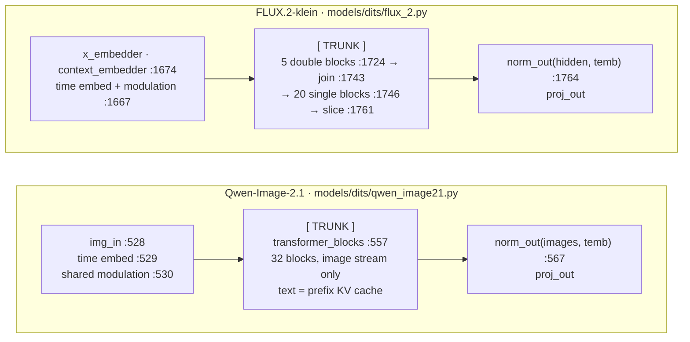

# Experiment 002: does trunk control need a per-model Binding?

Status: done · 2026-10-02 · SGLang @ `8ca82118e` ([ADR 0003](../../docs/adr/0003-sglang-first-engine.md))
· outcome recorded in [ADR 0012](../../docs/adr/0012-trunk-capabilities.md)
and [ADR 0013](../../docs/adr/0013-feasibility-and-engagement.md)

## In short

One TeaCache-style implementation (`opt_trunk_probe/policy.py`) observed,
replaced and skipped the transformer trunk of **Qwen-Image-2.1** and
**FLUX.2-klein-base-4B** without knowing which model it was. Everything
model-specific lived in two small Bindings (about 30 lines each). The claim
survives:

- **Both models share one trunk operation.** At its edges the trunk maps image
  tokens to image tokens of the same shape. FLUX.2's text stream lives and dies
  inside the trunk; Qwen-Image-2.1's text is a prefix cache. So one payload
  form, the image-stream residual, works for both.
- **The trunk is not a function in either model.** It is a stretch of inline
  code inside `forward`. A Binding defines it by two edges, the first block call
  and the output norm, plus what each block returns when told not to compute.
  The binding is declarative and small, not a god object.
- **In eager mode everything is exact.** Observation and identity override are
  bitwise identical to running without the probe; one-step reuse really
  suppressed every block (32 on Qwen, 2 × 25 on FLUX) and the rest of the
  request carried on correctly.
- **How it is compiled decides whether it works.** With regional compile
  (blocks only) everything stays exact and cheap. Under whole-model compile,
  SGLang's default, the hooks are traced into the graph: observation stays
  exact, but graph breaks roughly triple, and on FLUX.2 even an identity
  override changes the image. Under graph replay the hooks never run, so a
  requested reuse silently does nothing.

## The trunk, as SGLang builds it

Paths under `python/sglang/multimodal_gen/runtime/`, at the pinned commit.



| | Qwen-Image-2.1 | FLUX.2-klein-base-4B |
|---|---|---|
| trunk input | image tokens after `img_in` `(1, 4096, 4096)` | image tokens after `x_embedder` `(1, 4096, 3072)`, plus the text stream |
| trunk output | image tokens entering `norm_out`, same shape | image tokens entering `norm_out`, same shape; text is dropped |
| text / image | text is a prefix KV cache, written by the first call (prefill), only read afterwards | separate in 5 double blocks, joined once, one stream in 20 single blocks, sliced back |
| modulation | one set for all blocks, scale and gate only | per stream, shift, scale and gate |
| residuals | plain | blocks may return a *pending* gated residual (a tuple) that the next block or the join finishes |
| state across calls | the prefix KV cache | none |
| DiT calls per step | 1 (CFG off) | 2 (CFG branches run one after the other) |
| compiled as | whole model by default; per block with `--regional-compile` | whole model only (no `_compile_conditions`) |

A generic `trunk.run(context)` is not realistic: there is no trunk call to
wrap, and the two trunks take different arguments. What both *do* share is
the boundary: image tokens in, image tokens out. The capabilities below are
defined on that boundary and nothing finer. No per-block interface was needed,
so none was built.

## What was tested

The probe is three layers:

| Layer | File | Knows |
|---|---|---|
| implementation | `policy.py` | only the capabilities; no SGLang import, no model name, no tensor layout |
| SGLangAdapter | `adapter.py` | request, step and CFG branch from SGLang's forward context; per-request state on the request; opening a trunk call, suppressing blocks, replacing the exit |
| Bindings | `bindings.py` | per model: the DiT forward, the block classes, the exit module, a block's identity, the entry tensor, the signal, whether a call may be overridden |

The implementation consumes five capabilities:

| Capability | Contract the implementation relies on |
|---|---|
| `timestep_state` | step index and total steps of the current trunk call |
| `request_local_state` | a dict owned by one request *and one CFG branch*, gone with the request |
| `trunk_observe` | called once on entry and once on exit of every trunk invocation |
| `trunk_output_override` | on entry, return a payload instead of running the trunk; on exit, replace the result. A call may refuse to be overridden |
| `signal_observe` | an opaque tensor per call, same shape across one request and branch |

Payloads are made and applied below the contract: `output` (the trunk's own
result) or `residual` (exit − entry, in fp32), re-applied to whatever entry the
later call has.

Requests, one engine configuration loaded once:

| Mode | What happens |
|---|---|
| observe | nothing; log every trunk call |
| identity-output | run the trunk, hand its own output back through the override path |
| identity-residual | run the trunk, rebuild its output from a residual payload |
| reuse | at step K store a residual; at step K+1 run no block, rebuild from that residual |
| after-control | observe, after the controlled requests |

## Results

Image differences are against the same engine mode without the probe;
"identical" means every pixel matches. Times are client wall time per image on
one RTX 5090. Block counts are what the worker actually executed.

**Eager**

| | FLUX.2 (50 steps, K = 25) | Qwen-Image-2.1 (40 steps, K = 20) |
|---|---|---|
| baseline | 17.79 s | 13.60 s |
| observe | identical · 17.87 s · 2 trunk calls/step | identical · 13.66 s · 1 call/step |
| identity-output | identical · every call exact | identical · every call exact |
| identity-residual | identical · every call exact | identical · every call exact |
| reuse | **50 blocks skipped** (25 × 2 branches) · 41.6 dB · 17.57 s | **32 blocks skipped** · 46.8 dB · 13.40 s |
| after-control | identical | identical |
| not overridable | — | step 0, the prefill (always computed) |

For comparison, experiment 001's *step* override at the same K reached 39.2 dB
(FLUX) and 46.7 dB (Qwen): reusing the trunk residual is at least as good as
reusing the whole prediction, because the input embedding and output norm still
see the new step.

**torch.compile (whole model, the SGLang default)**

| | FLUX.2 | Qwen-Image-2.1 |
|---|---|---|
| observe | identical | identical |
| identity-output / -residual | **32.6 dB**: not identical | identical |
| reuse | 50 blocks skipped · 40.4 dB | 32 blocks skipped · 46.9 dB |
| after-control | identical | identical |
| recompiles / graph breaks (no probe → probe) | 21 / 134 → 112 / 397 | 68 / 74 → 130 / 268 |
| first request, which pays the recompiles (no probe → probe) | 19.43 s → 20.61 s | 13.48 s → 14.29 s |
| second request (no probe → probe) | 17.46 s → 17.45 s | 13.53 s → 13.54 s |

The hooks run inside the compiled forward, so dynamo traces them. Of the graph
breaks the probe adds in user code, some are reported at probe lines (24 of 88
on FLUX.2, 15 of 65 on Qwen); the rest appear in model code, presumably in the
graphs that resume after them. On FLUX.2 an identity override, whose payload
was checked to be the trunk's exact output, still changes the image. The
override itself is exact; what changes is how the compiled graph is split
around the replaced tensor. Even the probe's own equality checks are traced and
cannot be trusted under compile (on Qwen they reported "not equal" with zero
differing elements); only the image is.

**Regional compile (blocks only)**

Only Qwen-Image-2.1 supports it; FLUX.2 has no `_compile_conditions`, and
SGLang refuses to start (`regional compile found no matching submodules`).

| | Qwen-Image-2.1 |
|---|---|
| observe, identity-output, identity-residual, after-control | identical; the probe's own checks agree again |
| reuse | 32 blocks skipped · 46.9 dB |
| recompiles / graph breaks (no probe → probe) | 66 / 51 → 71 / 72 |
| first request (no probe → probe) | 13.48 s → 13.57 s |
| second request (no probe → probe) | 13.54 s → 13.58 s |

With the trunk loop left in Python and only the blocks compiled, the trunk edges
are outside compiled code and trunk control is exact and cheap. Regional compile
is the compile mode a trunk-level technique should ask for.

**Breakable CUDA graphs (Qwen-Image-2.1, prompt `"warmup"`, see exp 001 finding 7)**

| | with graphs | same requests, eager |
|---|---|---|
| trunk calls seen per request | **1** (the prefill) of 40 | 40 |
| reuse | **0 blocks skipped · image identical to baseline** | 32 blocks skipped · 49.5 dB |
| observe, identity, after-control | identical | identical |

Graph replay runs recorded GPU work; no Python inside the DiT runs, so the
hooks never see the 39 replayed calls. A reuse that was asked for silently did
not happen.

### The signal

Both Bindings expose the first block's modulated image input, the signal
TeaCache uses. It is computed in fp32 from the block's own inputs, outside the
model's fused kernels. The implementation only ever computes the relative L1
change between consecutive calls of one request and branch.

| | FLUX.2 | Qwen-Image-2.1 |
|---|---|---|
| formula (from the model) | LayerNorm(x)·(1 + scale) + shift | LayerNorm(x)·(1 + scale), no shift |
| relative L1 per call (min / median / max) | 0.0026 / 0.063 / 0.131 | 0.030 / 0.050 / 0.067 |

The concept is the same; the formula and the scale of the number are not. Any
threshold therefore belongs in measurement history per model, not in the
technique.

## Who owns what

| Concern | SGLangAdapter | ModelSpec | Binding | Why |
|---|---|---|---|---|
| request, step, CFG branch | ✓ | | | SGLang's forward context, the same for every model |
| per-item state (request × branch) | ✓ | | | lives on SGLang's request object |
| opening a trunk call, suppressing blocks, replacing the exit | ✓ | | | the mechanics are model-independent; only *where* is not |
| payload forms (output, residual) | ✓ | | | both trunks map image tokens to image tokens; first written in the Binding file, moved to the adapter |
| trunk location: DiT forward, block classes, exit module | | | ✓ | inline code in each model file |
| a block's identity return value | | | ✓ | FLUX double blocks return two streams, single blocks one, Qwen blocks one |
| which calls may be overridden | | | ✓ | Qwen's prefill writes the prefix cache; a SGLang × Qwen-Image-2.1 fact |
| signal formula | | ✓ | ✓ | "scale only" vs "shift + scale" is the architecture; where the modulation sits is the Binding |
| signal thresholds | | | | measurement history |
| compile and graph-capture behavior | ✓ | | | the engine's lifecycle; read from what the engine applied |

Each Binding is a list of class paths and four small functions. The engine-wide
logic stayed in the adapter.

## Findings

1. **The trunk is a region, not a call.** Neither model has a function to wrap.
   Its edges are the first block call and the output norm's input, and a
   Binding names both.
2. **The shared payload is the image-stream residual.** It is exact in eager on
   every call of both models. In fp32 it is not *guaranteed* exact: one call in
   one compiled FLUX run differed in a single element.
3. **Some trunk calls must not be overridden.** Qwen-Image-2.1's first call
   fills the prefix cache every later step reads. The capability needs a
   per-call "may not be overridden" answer, and only the Binding can give it.
4. **CFG branches need separate state.** FLUX runs two trunk calls per step;
   reuse stored and applied one payload per branch.
5. **Trunk control needs the trunk edges outside compiled code.** Regional
   compile keeps them there: exact, with a few extra graph breaks. Whole-model
   compile traces them: graph breaks triple, and overriding the exit can change
   numerics (FLUX). Trunk control is `dynamic_in_forward` in the sense of
   [ADR 0009](../../docs/adr/0009-lifecycle-constraints.md); it also needs a
   compile mode that leaves the trunk loop in Python, which FLUX.2 in SGLang
   does not offer.
6. **Graph replay makes trunk control a silent no-op.** Engagement has to be
   counted (blocks actually skipped), never inferred from the configuration.
7. **SGLang already puts trunk caching at the engine × model level.** Its
   TeaCache (`cache/teacache.py`) is a mixin each model implements in its own
   `forward`; neither Qwen-Image-2.1 nor FLUX.2 does, and its state lives on
   the model, not the request.
8. **FLUX.2's exit norm is a shared diffusers class.** The hook must act only
   on this model's own instance.

## Verdict

| Capability | Verdict | Evidence |
|---|---|---|
| `timestep_state` | validated | step index and total steps reach code inside the DiT call through SGLang's forward context, for both models |
| `request_local_state` | validated; owner is request × CFG branch | state must be per request *and* per CFG branch; ComfyUI has no request; concurrent requests not tested, so the final ownership model stays open |
| `trunk_observe` | validated | eager, regional and whole-model compile, bitwise transparent; not under graph replay |
| `trunk_output_override` | validated, **with a per-call refusal** | exact identity and real block suppression on both models; a Binding may declare a call not overridable (Qwen's prefill); needs regional compile or eager |
| `signal_observe` | validated, as an opaque tensor | same concept on both models, different formula and scale; the implementation only takes a relative change |

ADR 0010's `trunk_control` and `signal_tap` are replaced by the three trunk
capabilities above ([ADR 0012](../../docs/adr/0012-trunk-capabilities.md)).
Which execution modes they are usable in, and how a run proves it used them,
became a framework rule: [ADR 0013](../../docs/adr/0013-feasibility-and-engagement.md).

Against the falsification criteria set before the runs:

| The architecture is falsified if… | Result |
|---|---|
| the models share no trunk-level operation | not met: image tokens in, image tokens out |
| the generic implementation must inspect model classes | not met: `policy.py` names none |
| payloads cannot be abstracted | not met: one residual form for both; per-batch-slice payloads untested |
| trunk control needs invasive engine changes | not met: plugin hooks only, one of them on a shared diffusers class with an instance check |
| torch.compile makes Bindings unusable | not met with regional compile; whole-model compile degrades it, and FLUX.2 has no regional mode |
| graph capture makes per-request control impossible | **met, as expected**: trunk control is refused under graph capture ([ADR 0009](../../docs/adr/0009-lifecycle-constraints.md)) |
| Bindings accumulate engine-global logic | not met: all mechanics stayed in the adapter |
| the names only make sense in SGLang | not met: see below |

## Next experiment

The largest remaining uncertainty is not inside SGLang but in the contract:
both other engines can run **several requests or CFG branches in one DiT
call**, and nothing here exercised that. So the next experiment should make one
trunk call carry two independently controlled samples and check that override,
payload and signal still work per sample, with the implementation unaware of
the batch layout. If SGLang can batch these models (`batching_max_size > 1`),
that is the cheapest place to test it; if not, it becomes the first vLLM-Omni
experiment. A real cache policy (thresholds, quality against a gate) can follow
either way, because its mechanics are now in place.

## Portability sanity check (code reading only)

Read at vLLM-Omni `bbee488` and ComfyUI `1b883be`. Nothing was implemented.

| Capability | vLLM-Omni | ComfyUI |
|---|---|---|
| `timestep_state` | forward-context slots exist, but Qwen and FLUX pipelines do not fill them; each owns its loop | sigmas in `transformer_options`; **no step index**, and multi-call samplers break "one step = one call" |
| `request_local_state` | no request object reaches the DiT; one runner batch plays the role | no request at all; one sampling run plays the role |
| `trunk_observe` | same edges: blocks loop, `norm_out` (Qwen `qwen_image_transformer.py:1264,1279`; FLUX.2 `flux2_transformer.py:992–1015`) | same edges: `post_input` patch, `norm_out` / `final_layer` |
| `trunk_output_override` | **already exists**: its TeaCache replaces `forward` through per-model "extractors" (`cache/teacache/extractors.py`), a Binding in all but name; FLUX.2 residual is image-only like ours | no whole-stack patch; per-block replacement patches on every block, or a wrapper around `forward_orig` |
| `signal_observe` | same signal, first-block modulated input | recomputable from a block-0 replacement patch |

None of the capability names is SGLang-specific. Two contract gaps are:

- **One DiT call can serve several requests or branches.** ComfyUI batches
  cond and uncond into one call; vLLM-Omni batches requests. Override and
  signal would have to work per batch slice. SGLang ran one request and one
  branch per call here, so this was not exercised.
- **"Request" is not universal.** ComfyUI has none; the state's owner is one
  sampling run.

## Scope

- One prompt, one seed per model; this tests mechanics, not quality.
- Reuse covers one step. A real cache policy (thresholds, how often to reuse)
  is the next experiment's business.
- Concurrent requests were not tested: SGLang's default batching serves one
  request per DiT call (`batching_max_size = 1`).
- Graph mode was tested on Qwen-Image-2.1 only; FLUX.2 has no graph mode.

## Reproduce

Needs SGLang at the pinned commit and this directory installed
(`pip install -e .`, which registers the plugin entry point).

```bash
python run.py --model black-forest-labs/FLUX.2-klein-base-4B --out runs/flux-eager-plugin \
    --plan plans/flux-eager.json \
    --server-kwarg performance_mode=manual --server-kwarg 'warmup_resolutions=["1024x1024"]'
python run.py ... --out runs/flux-eager-noplugin --plan plans/flux-baseline.json --no-plugin
python analyze.py runs/flux-eager-noplugin runs/flux-eager-plugin
```

Compile adds `--server-kwarg enable_torch_compile=true` (plans `*-compile*.json`;
`regional_compile=true` for blocks only). Graph mode on Qwen-Image-2.1 adds
`--server-kwarg enable_breakable_cuda_graph=true` with `plans/qwen-bcg*.json`.
Qwen-Image-2.1 needs
`--server-kwarg 'component_residency=["dit=resident","text_encoder=layerwise-offload","vae=resident"]'`
to fit in 32 GB. `test_probe.py` checks the probe's contracts on CPU with a fake
model (`pytest test_probe.py`, needs torch).
